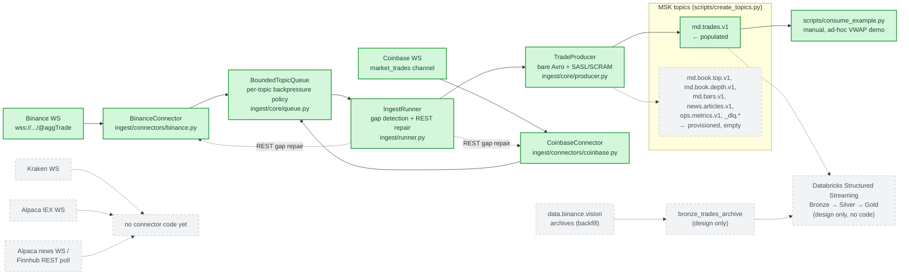
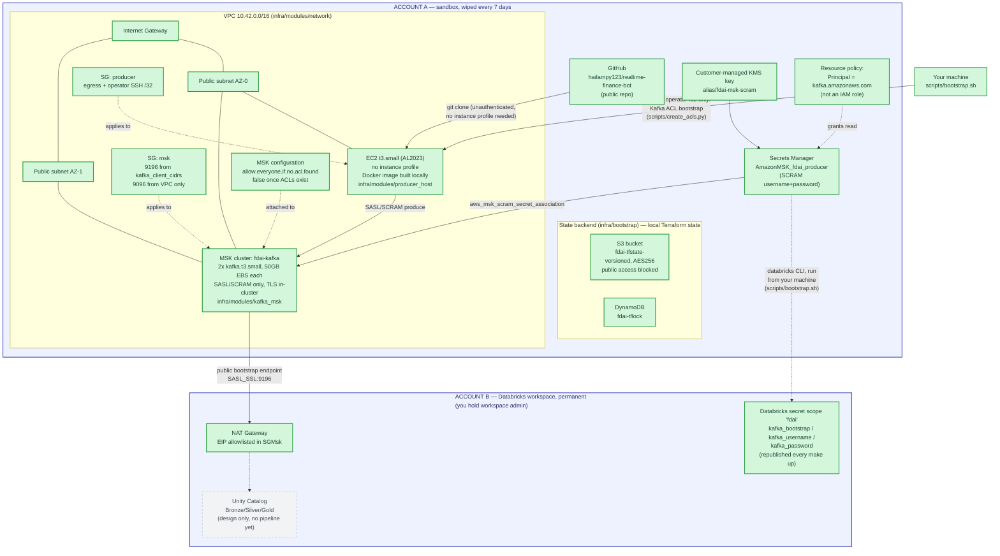

# Architecture — Current State

Two diagrams, both drawn from what actually exists in this repo today (source
files cited under each), not from the aspirational end-state in the parent
design spec. Solid green = built and live after `make up`. Dashed gray =
designed or sketched, no code yet. If a box isn't green, `make up` does not
create it.

For the target end-state these diagrams intentionally do **not** show, see
[`docs/superpowers/specs/2026-08-07-finance-data-ai-platform-design.md`](superpowers/specs/2026-08-07-finance-data-ai-platform-design.md)
(parent architecture) and
[`docs/superpowers/specs/2026-08-08-data-layer-batch-history-and-serving-design.md`](superpowers/specs/2026-08-08-data-layer-batch-history-and-serving-design.md)
(lakehouse). For install/config steps, see [`docs/SETUP.md`](SETUP.md). For a
resource-by-resource explanation of what `make up` creates and why — written for
someone new to Terraform and AWS — see
[`docs/MAKE_UP_EXPLAINED.md`](MAKE_UP_EXPLAINED.md). Two more written for the same
audience: [`docs/AWS_SERVICES_EXPLAINED.md`](AWS_SERVICES_EXPLAINED.md) (what each
AWS service is, with inspection commands) and
[`docs/KAFKA_EXPLAINED.md`](KAFKA_EXPLAINED.md) (Kafka, grounded in this repo's
own config), and [`docs/CODEBASE_EXPLAINED.md`](CODEBASE_EXPLAINED.md)
(directory-by-directory tour, module boundaries, where to make a change).

## 1. Data flow — what's actually moving today

**Reading this diagram:** the only two connectors that exist are Binance and
Coinbase; both write to `md.trades.v1` and nothing else, because no other
topic's producer code exists yet. Every trade sits in Kafka until either
`scripts/consume_example.py` is run manually or Stage 2 (Databricks
Structured Streaming) is implemented — right now, neither runs continuously.

## 2. Deployed AWS infrastructure — physical topology

**Reading this diagram:** every solid box in Account A is created and
destroyed by `make up` / `make down` (Terraform). The only thing that
persists Account A's state between runs is the S3 bucket in the same
account — which is why losing it on wipe is safe (§ the README's
reproducibility contract). The single link into Account B is the MSK public
bootstrap endpoint, reachable only from the CIDRs in `kafka_client_cidrs`
(the Databricks NAT EIP and your own IP) — no IAM role, no VPC peering, no
Private Link.

The one edge that looks out of place is the SSH arrow. MSK will not enable
public access unless `allow.everyone.if.no.acl.found` is false, which makes
Kafka deny-by-default, which means ACLs must already exist — and ACLs can only
be written over a reachable broker, which before public access means from
inside the VPC. The producer host is the only thing in there. Hence a
per-run keypair and a `/32` SSH rule that exist for exactly one step of
`make up`. The full reasoning is in [`docs/SETUP.md`](SETUP.md) §5f.

## 3. What "final deployed state (for now)" means

Running `make up` today gets you the entirety of diagram 2, plus the
Binance/Coinbase half of diagram 1. It does **not** get you: Kraken/Alpaca/
news connectors, DLQ writers, `md.book.*`/`md.bars.v1` producers, or anything
in Account B beyond the three secret values. Those are the concrete gaps
between "deployed" and "designed" as of this writing.
