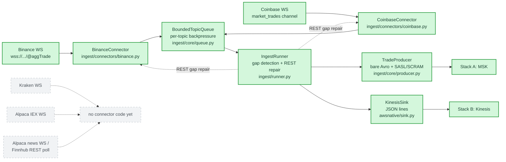
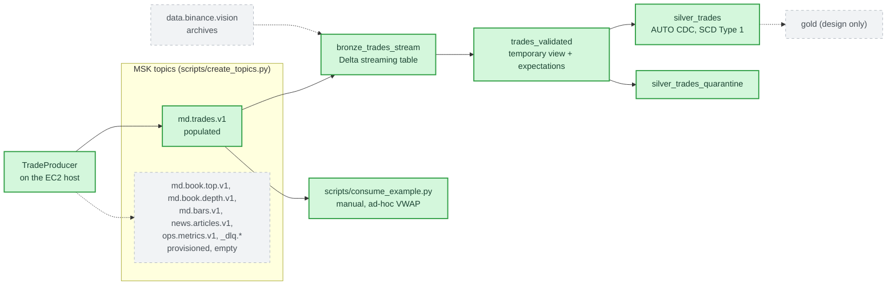
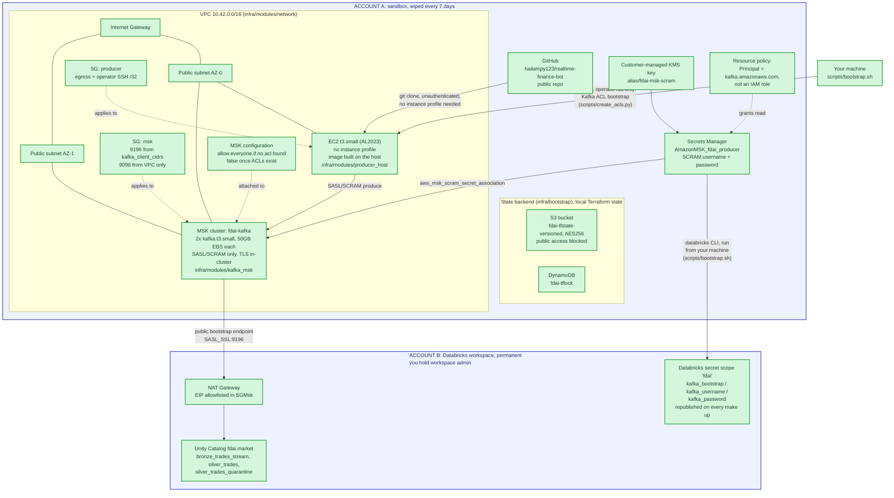
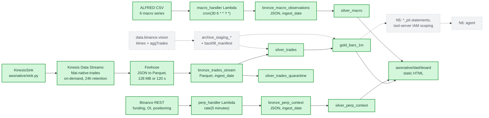
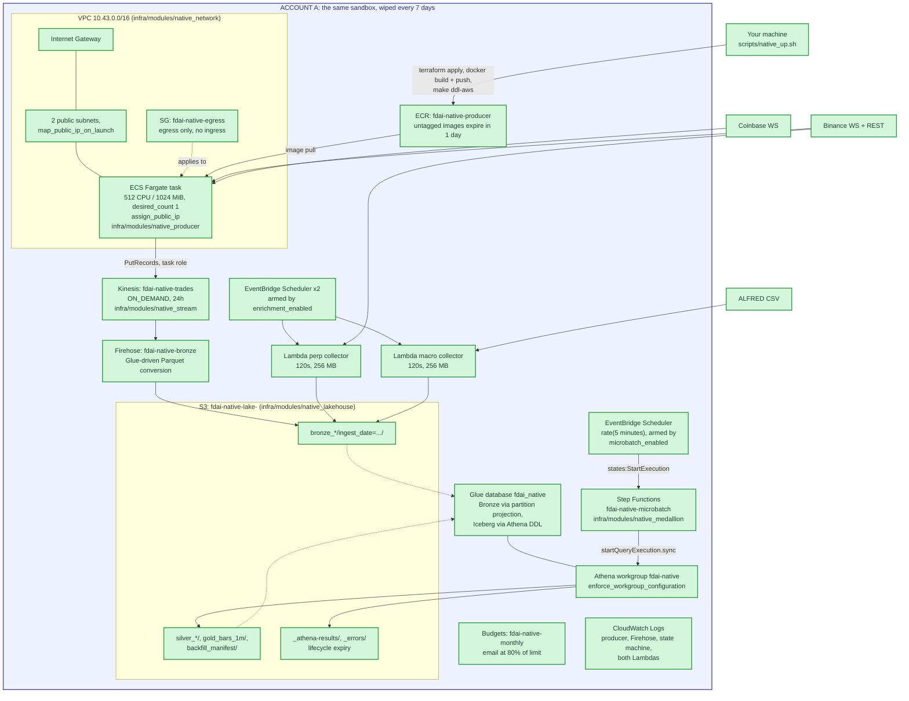

# Architecture: current state

What exists in this repo today, drawn from the source files cited under each
diagram. Solid green means built and live after the bring-up command. Dashed
gray means designed with no code yet. If a box is not green, no `make` target
creates it.

This document holds the topology. Table schemas and column contracts live in
[`DATA_LAYER.md`](DATA_LAYER.md). Install steps live in [`SETUP.md`](SETUP.md).
The target end state lives in the design specs, which these diagrams
deliberately do not show:
[platform](superpowers/specs/2026-08-07-finance-data-ai-platform-design.md),
[lakehouse](superpowers/specs/2026-08-08-data-layer-batch-history-and-serving-design.md),
[AWS-native](superpowers/specs/2026-08-14-aws-native-workstream-design.md).

---

## 1. Two stacks, one ingestion contract

The repo implements the same use case twice. Both stacks run the same Python
connectors against the same exchange feeds, then diverge at the sink.

| Property | Stack A: Kafka / Databricks | Stack B: AWS-native |
|---|---|---|
| Bring up | `make up` | `make up-aws` |
| Producer runs on | EC2 `t3.small`, Docker | ECS Fargate, 0.5 vCPU |
| Transport | MSK, SASL/SCRAM | Kinesis Data Streams, on-demand |
| Lands as | Kafka topic `md.trades.v1` | Parquet on S3, via Firehose |
| Transforms | PySpark in a Lakeflow pipeline | Athena SQL, driven by Step Functions |
| Durable store | Unity Catalog Delta, permanent account | nothing; re-derivation from public archives |
| VPC | `10.42.0.0/16` | `10.43.0.0/16` |
| Terraform env | `infra/envs/dev` | `infra/envs/native` |
| Bring-up time | 45 to 60 minutes | a few minutes |

Both can run at once. The CIDRs do not overlap, the state keys differ, and every
Stack B resource name carries the `fdai-native-` prefix.

## 2. Shared ingestion: the code above both sinks

Everything in this section ships in both stacks. `ingest/` holds no AWS-specific
and no Databricks-specific import.



Two connectors exist, Binance and Coinbase. Both emit trades and nothing else,
because no producer code exists for the other topics.

A queue sits between parsing and publishing because publishing must never block
frame consumption. A slow write would stall the WebSocket read buffer and the
exchange would disconnect. `md.trades.v1` blocks when the queue fills;
`md.book.*` would drop instead, because the next depth snapshot recovers a lost
update and nothing recovers a lost trade short of a REST call.

## 3. Stack A: Kafka and Databricks

### 3.1 What moves data



The pipeline is triggered, not continuous. Nothing downstream of Silver consumes
it yet, so an always-on cluster would spend money to feed nobody. Deploying and
running it is [`RUNBOOK_STAGE_2A.md`](RUNBOOK_STAGE_2A.md).

### 3.2 Where it runs



Terraform creates and destroys every solid box in Account A. The only thing that
outlives a run is the S3 state bucket, which sits in the same account and dies
in the same wipe. State and reality stay consistent because they disappear
together.

One link crosses into Account B: the MSK public bootstrap endpoint, reachable
only from the CIDRs in `kafka_client_cidrs`. That list holds the Databricks NAT
Elastic IP and your own address. There is no IAM role, no VPC peering, and no
PrivateLink.

The SSH arrow needs an explanation. MSK refuses to enable public access while
`allow.everyone.if.no.acl.found` is true. Setting it false makes Kafka
deny-by-default, so ACLs must already exist. Writing an ACL needs a reachable
broker, and before public access the only reachable place is inside the VPC. The
producer host is the only thing in there. Hence a per-run keypair and a `/32`
SSH rule that exist for one step of `make up`. Full reasoning:
[`SETUP.md`](SETUP.md) §5f.

Resource by resource, with cost: [`MAKE_UP_EXPLAINED.md`](MAKE_UP_EXPLAINED.md).

## 4. Stack B: AWS-native

### 4.1 What moves data



Backfill code exists in [`awsnative/backfill/`](../awsnative/backfill/) and its
tables have DDL, but no scheduled process runs it. Until stage N4 lands, Silver
and Gold hold only what has streamed in since the last bring-up.

### 4.2 Where it runs



Stack B uses IAM roles where Stack A cannot: a Fargate execution role, a task
role scoped to `PutRecords` on one stream, a Firehose delivery role, a state
machine role, and a scheduler role that can do nothing except start that one
execution. The sandbox permits creating roles; it forbids nothing this stack
needs. Run `make preflight-aws` to confirm that before spending 10 minutes on an
apply.

Lambda arrives only in the enrichment collectors. The producer runs as a
long-lived Fargate task, and the transforms run as Athena statements with no
code deployed at all.

### 4.3 The micro-batch

One Step Functions state machine runs the whole medallion. Definition:
[`infra/modules/native_medallion/main.tf`](../infra/modules/native_medallion/main.tf).

```text
CountRunningExecutions          sfn:listExecutions on this state machine
        │
   AlreadyRunning?  ──yes──▶  SkippedOverlappingRun  (Succeed)
        │ no
   MergeLayers  (Parallel)
        ├── MergeSilver       athena:startQueryExecution.sync
        └── MergeQuarantine   athena:startQueryExecution.sync
        │
   MergeGold                  athena:startQueryExecution.sync
```

The overlap guard exists because concurrent Iceberg merges scan the same data
twice and then fail on the commit lock. The two Silver branches run in parallel
because they write different tables from the same Bronze window. Gold waits for
both because it rebuilds only the partitions that moved, and it reads
`silver_trades` to find them.

`.sync` means Step Functions polls Athena directly. No Lambda sits in the loop,
so this stage deploys zero lines of code.

Run one cycle by hand with `make microbatch-aws`. Leave
`microbatch_enabled = false` on a first deploy, start an execution manually, and
read the graph before arming the schedule.

### 4.4 Cost shape

Kinesis on-demand and Firehose per-GB charges scale with traffic. Everything
else scales with hours the stack is up. The estimate in the design spec's §10
assumes roughly 130 hours a month, not continuous operation. That assumption
carries real weight: an armed schedule left running over a long weekend is the
easiest way to be surprised by a bill. Read the actual number from the "Data
scanned" column in the Athena console rather than trusting the arithmetic.

`aws_budgets_budget` emails at 80% of `monthly_budget_usd`. It reports; it does
not stop anything.

## 5. Gaps between deployed and designed

**Stack A.** `make up` creates every solid box in §3.2 and the Binance and
Coinbase half of §2. It does not create Kraken, Alpaca, or news connectors, DLQ
writers, `md.book.*` or `md.bars.v1` producers, or a Gold layer. The `_dlq.*`
topics exist per the design's dead-letter contract, but no code publishes to
them; an unparseable frame raises an exception and the WebSocket session
reconnects.

**Stack B.** `make up-aws` creates every solid box in §4.2 and fills Bronze,
Silver, and Gold from the live stream. Stages N4 (backfill and reconciliation),
N5 (point-in-time boundary), and N6 (agent) are designed and unbuilt, as are
slices E2 (order-book liquidity) and E4 (narrative). Table maintenance
(`OPTIMIZE`, `VACUUM`) is designed and unbuilt.

**Both.** Equity coverage stays IEX-only on Alpaca's free tier, roughly 2% of
volume; crypto carries the streaming workload. Nothing in either stack has run
in a real account since the last wipe, so every design assumption stays open
until someone brings it up.

Priority order for closing these gaps:
[`DATA_LAYER_NEXT_STEPS.md`](DATA_LAYER_NEXT_STEPS.md) §4.
