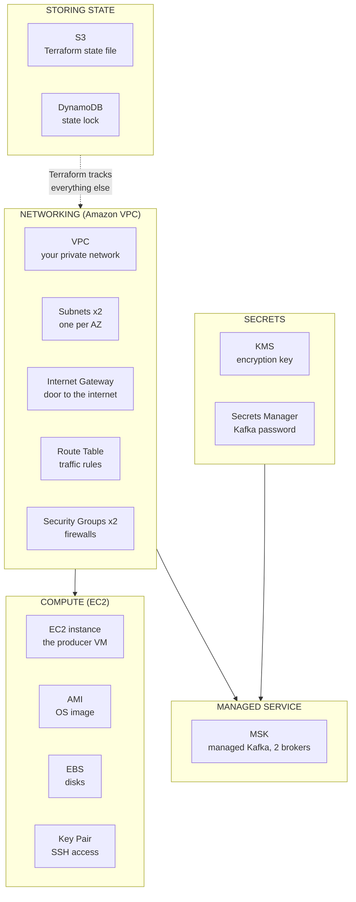
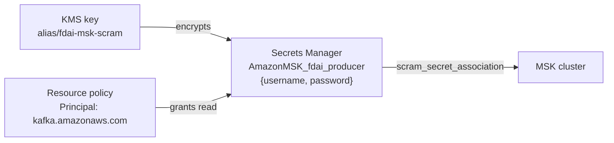

# AWS Services in This Project — A Practical Reference

Every AWS service this project touches: what it is, why it's here, and the command
to look at it. Terse on purpose.

Companions: [`MAKE_UP_EXPLAINED.md`](MAKE_UP_EXPLAINED.md) (the deploy sequence) ·
[`AWS_DEPLOYMENT_DEBUGGING.md`](AWS_DEPLOYMENT_DEBUGGING.md) (verification and
troubleshooting) · [`KAFKA_EXPLAINED.md`](KAFKA_EXPLAINED.md) (Kafka itself)

---

## 1. The map



---

## 2. Every service at a glance

| Service | What it is | Used here for | Count |
|---|---|---|---|
| **S3** | Object storage (files in buckets) | Terraform state file | 1 bucket |
| **DynamoDB** | Key-value database | Lock so two `apply`s can't collide | 1 table |
| **VPC** | Your own private network in AWS | Contains everything else | 1 |
| **Subnet** | An IP range inside a VPC, tied to one AZ | MSK needs 2 AZs | 2 |
| **Internet Gateway** | Lets a VPC reach the internet | Producer → Binance/Coinbase | 1 |
| **Route Table** | "Traffic for X goes to Y" | Send `0.0.0.0/0` to the IGW | 1 |
| **Security Group** | Firewall attached to a resource | Lock down Kafka + SSH ports | 2 |
| **EC2** | A virtual machine | Runs the producer container | 1 (`t3.small`) |
| **AMI** | Machine image (OS template) | Amazon Linux 2023 | lookup only |
| **EBS** | Virtual hard disk | 20 GB (EC2) + 50 GB × 2 (MSK) | 3 |
| **Key Pair** | SSH public key registered with EC2 | Shell in for the ACL step | 1 |
| **MSK** | Managed Apache Kafka | The message backbone | 1 cluster, 2 brokers |
| **KMS** | Encryption key management | Encrypts the Kafka secret | 1 key + 1 alias |
| **Secrets Manager** | Stores secrets, encrypted | Kafka SASL username/password | 1 secret |
| **IAM** | Identities and permissions | **Deliberately unused** — see §6 | 0 |

Full cost breakdown is in [`MAKE_UP_EXPLAINED.md`](MAKE_UP_EXPLAINED.md) §8.

---

## 3. Regions, AZs, and accounts

Three levels of "where," and you've already been bitten by the first one.

```text
AWS
└── Region  ap-southeast-1 (Singapore)      ← a geographic location
    ├── Availability Zone  ap-southeast-1a  ← an isolated datacentre
    │   └── Subnet  10.42.0.0/24
    └── Availability Zone  ap-southeast-1b
        └── Subnet  10.42.1.0/24
```

**Region** = a city-sized location. Resources in different regions can't see each
other privately. Most CLI commands are region-scoped and **silently return
nothing** if you point them at the wrong one — that's why `--region` matters.

**Availability Zone (AZ)** = a physically separate datacentre inside a region.
Spread across 2+ and one failing doesn't take you down. **MSK requires at least
2**, which is why this project has 2 subnets.

**Account** = a billing and isolation boundary. This project uses two:

| | Account A | Account B |
|---|---|---|
| Holds | MSK, EC2, VPC, S3 | Databricks workspace |
| Lifetime | **wiped every 7 days** | permanent |
| Region | `ap-southeast-1` (default) | `ap-southeast-2` |
| Your access | full, via `fdai-sandbox` profile | Databricks admin, **no AWS CLI** |

They don't share a region, and that's fine — they talk over the public internet.

### ARNs

Every resource has an **ARN** (Amazon Resource Name), a globally unique id:

```text
arn:aws:kafka:ap-southeast-1:<account-id>:cluster/fdai-kafka/abc-123
    │   │     │              │           │
    │   │     │              │           └── resource
    │   │     │              └── account id
    │   │     └── region
    │   └── service
    └── partition (always "aws" for normal use)
```

You'll paste these constantly. `terraform output cluster_arn` gives you this one.

---

## 4. Networking — the layer that confuses everyone

Four things stack up, and each one can independently block traffic:

```text
┌─ VPC 10.42.0.0/16 ────────────────────────────────┐
│                                                   │
│  ┌─ Subnet 10.42.0.0/24 (AZ-a) ────────────────┐  │
│  │                                             │  │
│  │   ┌─────────────┐      Security Group       │  │
│  │   │ EC2 / MSK   │ ◄─── (per-resource        │  │
│  │   └─────────────┘       firewall)           │  │
│  │                                             │  │
│  └─────────────────────────────────────────────┘  │
│                        │                          │
│                   Route Table                     │
│              "0.0.0.0/0 → IGW"                    │
│                        │                          │
└────────────────────────┼──────────────────────────┘
                         ▼
                Internet Gateway  ──►  internet
```

**All four must be right.** A missing route, or a security group with no matching
rule, and traffic dies with a timeout that names nothing. Debug in this order:

1. Does the SG allow the port from that source IP?
2. Does the route table send `0.0.0.0/0` to the IGW?
3. Is the IGW attached to the VPC?
4. Does the resource have a public IP?

**CIDR notation** — `10.42.0.0/16` means "the first 16 bits are fixed":

| CIDR | Addresses | Meaning |
|---|---|---|
| `10.42.0.0/16` | ~65,000 | the whole VPC |
| `10.42.0.0/24` | 256 | one subnet |
| `3.105.165.32/32` | **1** | exactly one machine |

`/32` is how you allowlist a single IP — which is what `kafka_client_cidrs` holds.

### Security groups here

```text
SG "msk"                                   SG "producer"
  IN  9196 ← kafka_client_cidrs              IN  22 ← your IP /32 (only if set)
  IN  9096 ← 10.42.0.0/16                    OUT everything
  OUT everything
```

Two properties worth knowing:

- **Default is deny.** Every rule is an explicit exception.
- **Stateful.** Allow traffic in, the reply gets out automatically. You never
  write return rules.

---

## 5. Service notes worth reading

### MSK — Managed Streaming for Apache Kafka

Real Kafka; AWS runs the brokers, patching, and replication. You get a
bootstrap endpoint; you don't get SSH.

- 2 × `kafka.t3.small`, 50 GB EBS each, one per AZ
- **2 endpoints, different DNS names:** `9096` SASL in-VPC, `9196` SASL public.
  Plaintext is **disabled** — the cluster sets `client_broker = "TLS"`, so there
  is no unencrypted port. (The `9092` elsewhere in this repo is the *local Docker*
  broker, unrelated to MSK.)
- Broker DNS is **regenerated every time the cluster is created** — hence the
  Databricks secret scope
- Cluster settings come from an `aws_msk_configuration` resource, not from
  arguments on the cluster

```bash
aws kafka list-clusters --region ap-southeast-1
aws kafka get-bootstrap-brokers --region ap-southeast-1 --cluster-arn <arn>
```

### KMS + Secrets Manager — the credential chain



**Secrets Manager** stores a secret and controls who reads it. **KMS** holds the
key that encrypts it. Two gotchas, both non-obvious:

- The secret name **must** start with `AmazonMSK_`. MSK rejects anything else.
- `recovery_window_in_days = 0` because a deleted secret normally keeps its name
  reserved for 7–30 days — which would break the next weekly rebuild.

```bash
aws secretsmanager list-secrets --region ap-southeast-1
aws kms list-aliases --region ap-southeast-1
```

### EC2 — and `user_data`

`user_data` is a script that runs **once, on first boot**, as root. It's how a
blank VM becomes a configured one with no image-building step: install Docker,
clone the repo, build, run.

Logs land in `/var/log/cloud-init-output.log` — the **first place to look** when a
host comes up but doesn't work:

```bash
ssh -i infra/envs/dev/.ssh/fdai-producer.pem ec2-user@<ip> \
  'sudo cat /var/log/cloud-init-output.log'
```

### S3 + DynamoDB — why a database for a lock

S3 alone can't do "check and set" atomically. Two `terraform apply`s could both
read state, both write, and one silently overwrites the other. DynamoDB gives a
conditional write: first writer creates a lock row, second one waits.

```bash
aws s3 ls s3://fdai-tfstate-<account-id>/dev/
aws dynamodb scan --table-name fdai-tflock --region ap-southeast-1
```

A leftover row after a crashed apply is a **stuck lock** — `terraform force-unlock`.

---

## 6. IAM — the service this project deliberately doesn't use

**IAM** is how AWS normally answers "who can do what." An **IAM role** is an
identity a service assumes to get permissions — e.g. an EC2 box with a role can
call S3 with no credentials on disk.

**This sandbox forbids creating IAM roles.** That single restriction shapes the
entire architecture:

| Can't have | Because | What's done instead |
|---|---|---|
| Databricks-on-AWS in Account A | Workspace creation needs a cross-account role | Separate permanent account |
| Instance profile on the EC2 box | That's an IAM role | `iam_instance_profile = null`; **public** git repo so no auth is needed |
| Lambda, ECS, Firehose | All require service roles | EC2 + Docker |
| MSK reading its own secret via a role | Role | **Resource policy** (below) |

**Resource policy vs IAM role** — the workaround worth understanding:

```text
IAM role            :  "this IDENTITY may read that secret"   ← needs role creation
Resource policy     :  "that SECRET may be read by this service"  ← attached to the secret
```

Same outcome, opposite direction, and only the second is permitted here. That's
`aws_secretsmanager_secret_policy` granting `kafka.amazonaws.com` read access.

---

## 7. Free things you get anyway

| | What | Where |
|---|---|---|
| **CloudWatch** | MSK and EC2 metrics, no config needed | Console → CloudWatch → Metrics |
| **Tags** | Every resource tagged `Project`/`ManagedBy`/`Ephemeral` via `default_tags` | Console → Resource Groups |
| **Service Quotas** | Per-account caps. Fresh sandboxes sometimes cap MSK brokers | Console → Service Quotas |

---

## 8. Command cheat sheet

```bash
# who am I, and where?
aws sts get-caller-identity
aws configure get region

# what exists (all region-scoped — wrong region = silent empty result)
aws ec2 describe-vpcs        --region ap-southeast-1
aws ec2 describe-instances   --region ap-southeast-1 \
  --query 'Reservations[].Instances[].[InstanceId,State.Name,PublicIpAddress]' --output table
aws ec2 describe-security-groups --region ap-southeast-1 \
  --query 'SecurityGroups[].[GroupName,GroupId]' --output table
aws kafka list-clusters      --region ap-southeast-1
aws secretsmanager list-secrets --region ap-southeast-1
aws s3 ls

# what Terraform thinks exists
terraform -chdir=infra/envs/dev state list
terraform -chdir=infra/envs/dev output

# find every resource this project made (via tags)
aws resourcegroupstaggingapi get-resources \
  --tag-filters Key=Project,Values=fdai --region ap-southeast-1 \
  --query 'ResourceTagMappingList[].ResourceARN' --output table
```

---

## 9. Traps that cost real time

| Symptom | Cause |
|---|---|
| CLI returns **nothing**, no error | Wrong `--region`. Almost always this |
| `InvalidClientTokenId` | Expired credentials — refresh your sandbox creds |
| Connection **timeout** to a broker | Security group. A timeout = blocked; a *refused* = reached but nothing listening |
| Timeout after your Wi-Fi changed | Your public IP moved and the `/32` is stale. `make up` re-detects it |
| `make down` didn't zero the bill | KMS keys bill through a mandatory 7-day deletion window |
| Bucket name already taken | S3 names are **globally unique** across all AWS customers |
| Can't find the NAT Gateway EIP | It's in Account B's VPC, invisible from Databricks' console and API |

**The one rule:** if an AWS CLI command returns empty and you expected data, check
`--region` before anything else.
