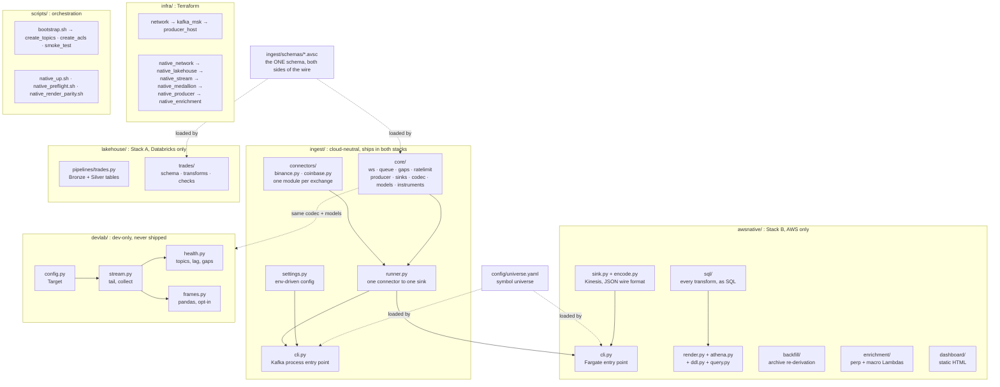
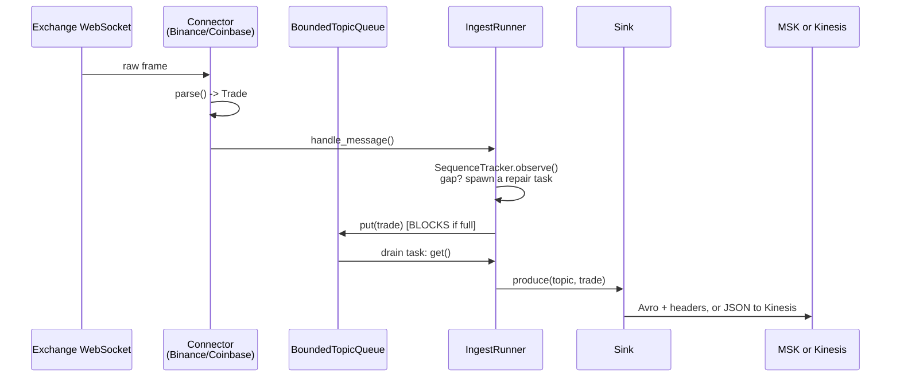
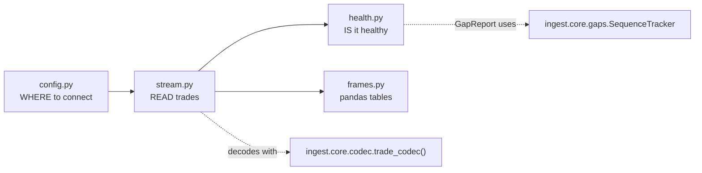

# Codebase, explained

What is in this repo, how the pieces connect, and where a given change belongs.

Companions: [`ARCHITECTURE.md`](ARCHITECTURE.md) (built versus designed) ·
[`DATA_LAYER.md`](DATA_LAYER.md) (the tables) ·
[`AWS_SERVICES_EXPLAINED.md`](AWS_SERVICES_EXPLAINED.md) ·
[`KAFKA_EXPLAINED.md`](KAFKA_EXPLAINED.md) ·
[`MAKE_UP_EXPLAINED.md`](MAKE_UP_EXPLAINED.md)

---

## 1. The map



**The rule that explains the folder split: what ships where.**

| Package | Ships to | Never ships to |
|---|---|---|
| `ingest/` | the EC2 Docker image and the Fargate image | nothing |
| `awsnative/` | the Fargate image and the enrichment Lambda | the EC2 image |
| `lakehouse/` | the Databricks workspace | either container image |
| `devlab/` | nothing | any image; it is local tooling |

`pyproject.toml` records the reason for the last row: *"devlab is dev-loop
tooling, not runtime"*. If your change must run in the sandbox, it belongs in
`ingest/` or `awsnative/`. If it only helps you look at data on your laptop, it
belongs in `devlab/`.

---

## 2. Directory by directory

| Directory | What | Ships to production |
|---|---|---|
| `ingest/` | Connectors, resilience core, sink protocol, CLI | yes, both stacks |
| `awsnative/` | Kinesis sink, Athena SQL and its runners, backfill, enrichment, dashboard | yes, Stack B |
| `lakehouse/` | PySpark Bronze and Silver definitions | yes, Stack A |
| `devlab/` | Notebook helpers: connect, tail, health-check, DataFrame | no |
| `infra/` | Terraform for both stacks, plus the state backend | provisions it |
| `scripts/` | Bootstrap orchestration, ACLs, topics, smoke test, preflight | some, over SSH |
| `config/` | `universe.yaml`, the symbol list | yes, read at runtime |
| `docker/` | `Dockerfile` and the local compose stack | yes, the image |
| `resources/` | `trades.pipeline.yml`, the Lakeflow pipeline definition | yes, Stack A |
| `notebooks/` | Jupyter notebooks over `devlab` | no |
| `tests/` | Mirrors every production package, plus `integration/` | no |
| `docs/` | This doc set, plus specs and plans | no |

---

## 3. The live data path

Both stacks share everything above the sink. This is that shared part;
[`ARCHITECTURE.md`](ARCHITECTURE.md) §2 draws the same flow with build status.



**Why a queue sits between parsing and publishing**
([`runner.py:24-31`](../ingest/runner.py#L24-L31)): publishing must never block
frame consumption. A slow write stalls the WebSocket read buffer and the
exchange drops the connection. The queue absorbs that.

**Why `md.trades.v1` blocks when full while `md.book.*` would drop**
([`queue.py:24-31`](../ingest/core/queue.py#L24-L31)): the next depth snapshot
recovers a dropped book update. Nothing recovers a dropped trade except a REST
call. Losing a trade silently is the one failure this system must not have, so
the producer blocks, takes the gap, and repairs it.

**One connector per exchange, and nothing else.** `connectors/base.py` defines
the `Connector` protocol. `binance.py` and `coinbase.py` implement it and know
nothing about Kafka or Kinesis. `core/` knows resilience and nothing about
exchanges. `ingest/schemas/*.avsc` is data, shared by both sides of the wire.

---

## 4. `ingest/core/`: what each file owns

| File | Owns | Does not own |
|---|---|---|
| [`ws.py`](../ingest/core/ws.py) | Reconnecting WebSocket client | Message parsing |
| [`queue.py`](../ingest/core/queue.py) | Per-topic backpressure policy | What is in the queue |
| [`gaps.py`](../ingest/core/gaps.py) | `SequenceTracker`, which detects missed sequence numbers | How a gap gets repaired |
| [`ratelimit.py`](../ingest/core/ratelimit.py) | Per-venue token bucket for REST | Which REST call to make |
| [`sinks.py`](../ingest/core/sinks.py) | The `Sink` protocol both stacks implement | Any transport |
| [`producer.py`](../ingest/core/producer.py) | Kafka producer config and `produce()` | Encoding format |
| [`codec.py`](../ingest/core/codec.py) | Avro encode and decode against `.avsc` | What a `Trade` is |
| [`models.py`](../ingest/core/models.py) | `Trade` dataclass, `kafka_key()` | Kafka wire format |
| [`instruments.py`](../ingest/core/instruments.py) | Venue symbol to canonical `instrument_id` | Which venues exist |

Every row is independently testable, which is why `tests/core/` mirrors this
list file for file. To place a change, find the row whose "owns" column matches
it. If nothing matches, either a new module is warranted or the change is
cross-cutting.

**The most depended-upon symbols**, from the dependency graph: `Target`
(`devlab/config.py`, 35 edges), `Trade` (`models.py`, 34 edges), `record()` (a
test fixture, 29 edges), `SequenceTracker` (`gaps.py`, 24 edges), and `Gap`
(`gaps.py`, 22 edges). A change to `Trade`'s shape reaches the connectors, both
sinks, the codec, and every `devlab` module.

---

## 5. `awsnative/`: Stack B, in four groups

Nothing here imports from `lakehouse/`, and nothing in `ingest/` imports from
here. The dependency runs one way: `awsnative` implements
`ingest.core.sinks.Sink`.

### 5.1 The producer

| File | What it is |
|---|---|
| [`sink.py`](../awsnative/sink.py) | `KinesisSink`, the AWS-native `Sink` implementation |
| [`encode.py`](../awsnative/encode.py) | `Trade` to JSON, the AWS-native wire format |
| [`cli.py`](../awsnative/cli.py) | The Fargate entry point |
| [`settings.py`](../awsnative/settings.py) | Env-driven config for the above |

Stack B sends JSON rather than Avro because Firehose's record-format conversion
reads JSON and writes Parquet using the Glue table's schema. The Avro schema
still governs Stack A.

### 5.2 SQL and the machinery that runs it

Every transform is a `.sql` file. Terraform bakes the merge statements into the
state machine, and Python reads the same files for tests and manual runs.
`scripts/native_render_parity.sh` proves both readers produce identical text.

| File | What it is |
|---|---|
| [`sql/`](../awsnative/sql/) | DDL, merges, fragments, verification, and dashboard queries |
| [`render.py`](../awsnative/render.py) | Renders the templates. Uses `string.Template` because its `${...}` syntax matches Terraform's `templatefile()` |
| [`athena.py`](../awsnative/athena.py) | Synchronous Athena client (start, poll, fetch) plus a quote-aware statement splitter |
| [`ddl.py`](../awsnative/ddl.py) | `python -m awsnative.ddl` creates the Iceberg tables. Idempotent |
| [`query.py`](../awsnative/query.py) | `python -m awsnative.query` runs one `.sql` file and prints results with bytes scanned |
| [`bars.py`](../awsnative/bars.py) | The additive-measure contract as executable Python. Production imports nothing from it; it exists so a test can check the DDL against it |

The SQL layout, and which file writes which table, is in
[`DATA_LAYER.md`](DATA_LAYER.md) §4.

### 5.3 `backfill/`: re-derive history from the archive

Seven of the eight modules are pure: no network, no clock, no AWS. Only
`loader.py` touches the network, which is what makes the parsing and planning
logic testable against real archive bytes.

| File | Owns |
|---|---|
| [`tiers.py`](../awsnative/backfill/tiers.py) | Which archive files a window needs, and their URLs. `DEEP` is monthly klines; `HOT` is daily aggTrades |
| [`seed.py`](../awsnative/backfill/seed.py) | Plans one run and writes the work list |
| [`loader.py`](../awsnative/backfill/loader.py) | Downloads, verifies, stages. The only network caller |
| [`checksum.py`](../awsnative/backfill/checksum.py) | Verifies a file against its sibling `.CHECKSUM` |
| [`parsers.py`](../awsnative/backfill/parsers.py) | Archive CSV to typed rows |
| [`epoch.py`](../awsnative/backfill/epoch.py) | Normalizes archive timestamps to microseconds |
| [`staging.py`](../awsnative/backfill/staging.py) | Typed rows to gzipped CSV for `archive_staging_*` |
| [`manifest.py`](../awsnative/backfill/manifest.py) | Work items and outcomes for one run |

The code exists and its tables have DDL. No scheduled process runs it yet; that
is stage N4.

### 5.4 `enrichment/` and `dashboard/`

| File | Owns |
|---|---|
| [`enrichment/perp.py`](../awsnative/enrichment/perp.py) | Binance USD-M perpetual context: funding, open interest, positioning. Pure |
| [`enrichment/macro.py`](../awsnative/enrichment/macro.py) | FRED series, stamped with the ALFRED vintage. Pure |
| [`enrichment/collect.py`](../awsnative/enrichment/collect.py) | The two Lambda handlers. The only network caller |
| [`dashboard/cli.py`](../awsnative/dashboard/cli.py) | Runs the five dashboard queries and builds the page |
| [`dashboard/charts.py`](../awsnative/dashboard/charts.py) | Inline SVG builders. Strings in, string out |
| [`dashboard/page.py`](../awsnative/dashboard/page.py) | Assembles one self-contained HTML document |

The same split repeats in every group: one module holds the I/O, the rest stay
pure. Test the pure modules against recorded payloads and the impure one stays
small enough to read.

---

## 6. `lakehouse/`: Stack A, on Databricks

| File | Owns |
|---|---|
| [`pipelines/trades.py`](../lakehouse/pipelines/trades.py) | The table and view declarations, and the Kafka read options |
| [`trades/schema.py`](../lakehouse/trades/schema.py) | Loads `ingest/schemas/trade.v1.avsc` at runtime |
| [`trades/transforms.py`](../lakehouse/trades/transforms.py) | `classify_trades`, `valid_trades`, `quarantined_trades` |
| [`trades/checks.py`](../lakehouse/trades/checks.py) | The expectation set applied to `trades_validated` |

`databricks.yml` syncs the whole repo rather than `lakehouse/` alone, because
`schema.py` reads the same `.avsc` file the producer encodes with. Copying the
schema instead would reintroduce the drift `ingest/core/codec.py` exists to
prevent.

---

## 7. `devlab/`: connect once, reuse everywhere

Four files, each answering one question a notebook needs.



**`config.py` holds `Target`, the resolved broker endpoint.** Three constructors
build one. `local()` uses the compose broker and ignores `.env` on purpose:
asking for local must never round-trip to AWS silently. `msk()` reads `INGEST_*`
from `.env`. `from_terraform()` reads live stack outputs, which is slower but
cannot go stale, since [broker DNS changes on every
`make up`](../devlab/config.py#L165-L167). `resolve()` picks one from
`$FDAI_TARGET` and defaults to `local`. The password stays out of `repr`
[deliberately](../devlab/config.py#L42-L44): Jupyter echoes the last expression
in a cell, and a bare `Target` is exactly what you would evaluate to check where
you are pointed.

**`stream.py` reads are always bounded.** `tail()` requires `limit=` or
`seconds=` ([enforced](../devlab/stream.py#L116-L117)). An unbounded read
against a quiet topic looks identical to a hang, with no way to tell whether it
waits on the broker, the network, or an empty partition. It decodes with the
same `trade_codec()` the producer encodes with, so one schema governs here too.
`_check_topic()` fails fast with venue-specific hints instead of polling an
absent topic.

**`health.py` answers three questions separately**
([module docstring](../devlab/health.py#L1-L11)). `topics()` and `partitions()`
ask whether anything is in the log. `rate()` asks whether anything arrives now.
`sequence_gaps()` asks whether anything was missed, replaying records through
the same `SequenceTracker` the live runner uses. One venue is excluded:
[`CONNECTION_SCOPED_SEQUENCE_VENUES = {"coinbase"}`](../devlab/health.py#L36).
Coinbase's sequence number is connection-wide, not per-symbol, so checking it
against a multi-partition read would report confident nonsense. Skipping it
honestly beats reporting it as clean.

**`frames.py` previews the lakehouse contract in pandas.** `dedupe()` and
`bars()` are written as [the pandas equivalents of the Silver and Gold
contracts](../devlab/frames.py#L1-L6), a place to get the semantics right before
rewriting them as Structured Streaming or Athena SQL. Each carries its PySpark
equivalent in a docstring, so `bars()` maps to
`groupBy(window("event_ts", freq), *by)`. Bars key on `event_ts`, never
`ingest_ts`; arrival time would let a slow consumer reshape the data. This is
the only file that needs `pandas`, gated behind the `notebook` dependency group
so the runtime image stays small.

**What that gating means for tests:**
[`tests/devlab/test_frames.py:7`](../tests/devlab/test_frames.py#L7) opens with
`pytest.importorskip("pandas")`. Under plain `make test`, with no `notebook`
group installed, those tests skip rather than fail. `make notebook-test`
installs the group and runs them. Copy that pattern when you add a pandas import
to a new `devlab` file.

---

## 8. Configuration: four layers, four owners

| Layer | File | Owner | Read by |
|---|---|---|---|
| Runtime env | `.env`, from `.env.example` | you, per machine | `ingest/settings.py`, `awsnative/settings.py` (`INGEST_*`) |
| Symbol universe | `config/universe.yaml` | git | `ingest/core/instruments.py` |
| Stack A infra | `infra/envs/dev/terraform.tfvars` | you, per machine | Terraform only |
| Stack B infra | `infra/envs/native/terraform.tfvars` | you, per machine | Terraform only |

`Settings` ([`ingest/settings.py`](../ingest/settings.py)) is a
`pydantic-settings` `BaseSettings`, so env vars are validated and typed at
startup instead of read from `os.environ` in scattered places. Widening the
symbol universe touches `config/universe.yaml` alone. It never touches connector
code, because connectors resolve venue symbols through `InstrumentMap` rather
than knowing the list.

Every variable, with its default and its effect: [`SETUP.md`](SETUP.md) §5.

---

## 9. Tests: one directory per production package

```text
tests/
├── core/          mirrors ingest/core/, file for file
├── connectors/    mirrors ingest/connectors/, plus test_protocol.py
├── awsnative/     mirrors awsnative/, incl. backfill/ enrichment/ dashboard/
├── lakehouse/     Spark transforms and expectations
├── devlab/        mirrors devlab/, gated on pandas where needed
├── integration/   docker-compose Kafka and a real producer, RUN_INTEGRATION=1
└── test_*.py      scripts/ and runner-level tests, flat
```

566 tests collect in the default suite.

**`test_protocol.py`** is the one file with no matching module. It asserts both
connectors satisfy the same `Connector` protocol, which is what makes adding a
third venue a matter of implementing an interface rather than guessing at
conventions.

**Integration tests need a real broker**, so the `test-integration` target gates
them behind `RUN_INTEGRATION=1` and depends on `compose-up`.

**Gates, and what each one covers:**

| Command | Covers |
|---|---|
| `make check` | Ruff, strict mypy, the default pytest suite |
| `make lakehouse-test` | Spark and lakehouse behavior |
| `make notebook-test` | Notebook and `devlab` behavior, with pandas installed |
| `make test-integration` | The local Kafka end-to-end path |
| `make validate-aws` | Terraform validate, fmt, and the SQL render parity check |

CI runs three jobs in parallel: `python` (ruff, mypy, unit tests), `terraform`
(validate, fmt), and `integration` (real Kafka). One inconsistency is worth
knowing: CI's `python` job runs `mypy ingest` only, while local `make typecheck`
runs `mypy ingest devlab`. A `devlab` type error can pass CI and fail locally.

---

## 10. Making a change: where does it go?

| I want to | Touch |
|---|---|
| Add a third exchange | New file in `connectors/`, implement `Connector`, add to `CONNECTORS` in `cli.py`, satisfy `test_protocol.py` |
| Widen the symbol list | `config/universe.yaml` only |
| Add a field to `Trade` | `models.py` plus `ingest/schemas/trade.v{n+1}.avsc`. Never edit v1 in place; see `test_schema_compat.py` |
| Change a Stack B transform | The `.sql` file in `awsnative/sql/`, then `make validate-aws` |
| Add a Stack B table | New numbered file in `awsnative/sql/ddl/`, then a row in [`DATA_LAYER.md`](DATA_LAYER.md) §4 |
| Add a notebook helper | `devlab/`, a matching test in `tests/devlab/`, `pytest.importorskip` if it needs pandas |
| Change backpressure for a topic | `TOPIC_POLICIES` in `queue.py` |
| Change Stack A infra | `infra/modules/{network,kafka_msk,producer_host}`; see [`MAKE_UP_EXPLAINED.md`](MAKE_UP_EXPLAINED.md) |
| Change Stack B infra | `infra/modules/native_*`, then `make validate-aws` |
| Add a Kafka topic | `TOPIC_SPECS` in `scripts/create_topics.py` |

**Internalize the schema rule.** The producer and the Spark reader load the same
`.avsc` file, which is what makes drift impossible by construction. A new schema
version is a new file, `trade.v2.avsc`, never an edit to `trade.v1.avsc`.
`test_schema_compat.py` enforces backward compatibility between adjacent
versions in CI.

---

## 11. What is built, and what is designed

Everything above is real code. Designed with no code yet: Kraken, Alpaca, and
news connectors; `md.book.*` and `md.bars.v1` producers; DLQ writers; a Gold
layer on the Databricks side; and stages N4 through N6 on the AWS-native side.
The full gap list is [`ARCHITECTURE.md`](ARCHITECTURE.md) §5.
