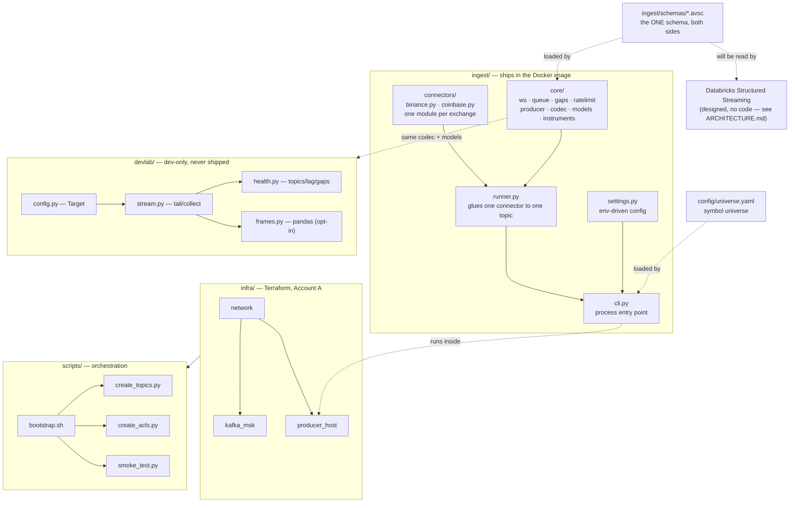
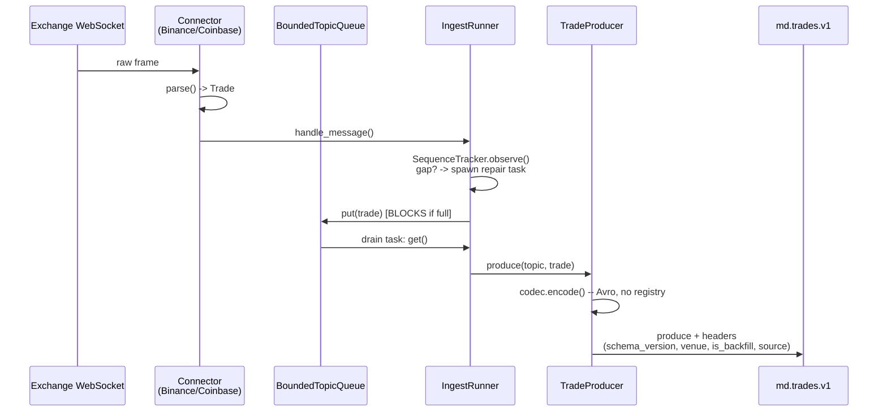
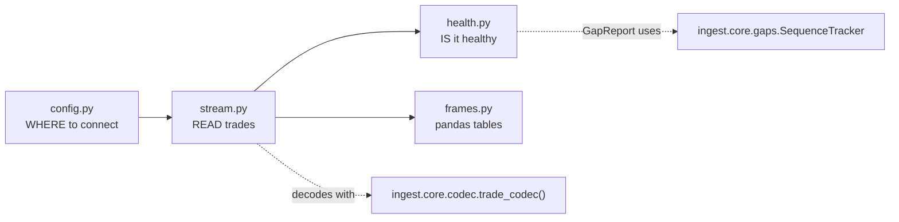

# Codebase, Explained

What's in this repo, how the pieces connect, and where to make a change.

Companions: [`ARCHITECTURE.md`](ARCHITECTURE.md) (what's built vs. designed) ·
[`AWS_SERVICES_EXPLAINED.md`](AWS_SERVICES_EXPLAINED.md) ·
[`KAFKA_EXPLAINED.md`](KAFKA_EXPLAINED.md) · [`MAKE_UP_EXPLAINED.md`](MAKE_UP_EXPLAINED.md)

---

## 1. The map



**The one rule that explains the folder split:** `ingest/` is what runs in
production — it ships in the Docker image on the EC2 producer host, and
`docker/Dockerfile` copies only that. `devlab/` is a notebook convenience layer
that imports `ingest/core` but is never copied into the image
([`pyproject.toml`](../pyproject.toml) comment: *"devlab is dev-loop tooling, not
runtime"*). If you're editing something that needs to run on the sandbox host,
it's in `ingest/`. If you're editing something that helps *you* look at data
locally, it's in `devlab/`.

---

## 2. Directory-by-directory

| Dir | What | Ships to prod? |
|---|---|---|
| `ingest/` | Connectors, resilience core, producer, CLI | **Yes** |
| `devlab/` | Notebook helpers: connect, tail, health-check, DataFrame | No |
| `infra/` | Terraform — Account A (sandbox) | — (provisions the infra) |
| `scripts/` | Bootstrap orchestration, ACLs, topics, smoke test | Some, via SSH |
| `config/` | `universe.yaml` — the symbol list | Yes (read at runtime) |
| `docker/` | `Dockerfile` + local compose stack | Yes (the image) |
| `notebooks/` | Jupyter notebooks using `devlab` | No |
| `tests/` | Mirrors `ingest/`, `devlab/`, `scripts/`, plus `integration/` | No |
| `docs/` | This doc set, plus specs and plans | No |

---

## 3. The live data path

This is the only path with real data flowing through it today —
[`ARCHITECTURE.md`](ARCHITECTURE.md) §1 has the full built-vs-designed diagram.



**Why a queue sits between parsing and publishing**
([`runner.py:24-31`](../ingest/runner.py#L24-L31)): publishing must never block
frame consumption, or a slow Kafka write stalls the WebSocket read buffer and
the exchange disconnects you. The queue absorbs that.

**Why `md.trades.v1` blocks when full, but `md.book.*` would drop**
([`queue.py:24-31`](../ingest/core/queue.py#L24-L31)): a dropped depth update is
recoverable from the next snapshot; a dropped trade is not recoverable at all
short of a REST call. Silent trade loss is the one failure this system must not
have — so the producer blocks, takes the gap, and repairs it.

**One connector, one exchange, nothing else.** `connectors/base.py` defines the
`Connector` protocol; `binance.py` and `coinbase.py` each implement it and know
nothing about Kafka. `core/` knows resilience and nothing about exchanges.
`ingest/schemas/*.avsc` is data, shared by both sides of the wire. This is the
`Explore` agent's job made concrete: three questions per module — *what does it
do, how do you use it, what does it depend on* — and each of these answers in one
line.

---

## 4. `ingest/core/` — what each file actually owns

| File | Owns | Doesn't own |
|---|---|---|
| [`ws.py`](../ingest/core/ws.py) | Reconnecting WebSocket client | Message parsing |
| [`queue.py`](../ingest/core/queue.py) | Per-topic backpressure policy | What's in the queue |
| [`gaps.py`](../ingest/core/gaps.py) | `SequenceTracker` — detects missed sequence numbers | How a gap gets repaired |
| [`ratelimit.py`](../ingest/core/ratelimit.py) | Per-venue token bucket for REST | Which REST call to make |
| [`producer.py`](../ingest/core/producer.py) | Kafka producer config + `produce()` | Encoding format |
| [`codec.py`](../ingest/core/codec.py) | Avro encode/decode against `.avsc` | What a Trade *is* |
| [`models.py`](../ingest/core/models.py) | `Trade` dataclass, `kafka_key()` | Kafka wire format |
| [`instruments.py`](../ingest/core/instruments.py) | Venue-symbol → canonical `instrument_id` | Which venues exist |

Each row is independently testable, which is why `tests/core/` mirrors this list
file-for-file. If you're not sure where a change belongs, find the row whose
"owns" column matches what you're changing — if nothing matches, that's a sign
that either a new module is warranted or the change is cross-cutting.

**The god nodes, per the dependency graph** (most depended-upon symbols):
`Target` (`devlab/config.py`, 35 edges) · `Trade` (`models.py`, 34 edges) ·
`record()` (test fixture, 29 edges) · `SequenceTracker` (`gaps.py`, 24 edges) ·
`Gap` (`gaps.py`, 22 edges). Changing any of these ripples the furthest —
`Trade`'s shape, in particular, is load-bearing across connectors, the producer,
the codec, and every `devlab` module.

---

## 5. `devlab/` — connect once, reuse everywhere

Four files, each answering one question a notebook needs
([`devlab/__init__.py`](../devlab/__init__.py)):



**`config.py` — `Target`, the resolved broker endpoint.** Three ways to build
one: `local()` (compose broker, ignores `.env` on purpose — asking for local
should never silently round-trip to AWS), `msk()` (reads `INGEST_*` from
`.env`), `from_terraform()` (reads live stack outputs — slower, but the only
source that can't go stale since [broker DNS changes on every
`make up`](../devlab/config.py#L165-L167)). `resolve()` picks one from
`$FDAI_TARGET`, defaulting to `local`. The password is excluded from `repr` —
[deliberately](../devlab/config.py#L42-L44), since Jupyter echoes the last
expression in a cell and a bare `Target` is exactly what you'd evaluate to check
what you're pointed at.

**`stream.py` — bounded reads, always.** `tail()` requires at least one of
`limit=` or `seconds=`
([enforced](../devlab/stream.py#L116-L117)) — an unbounded read against a quiet
topic in a notebook cell looks identical to a hang, with no way to tell whether
it's waiting on the broker, the network, or an empty partition. Decodes with the
*same* `trade_codec()` the producer encodes with, so there's exactly one schema
in play here too. `_check_topic()` fails fast with venue-specific hints rather
than polling an absent topic forever.

**`health.py` — three separate questions, answered separately**
([module docstring](../devlab/health.py#L1-L11)): `topics()`/`partitions()` — is
there anything in the log; `rate()` — is anything arriving *now*; `sequence_gaps()`
— did we miss anything. The last one replays records through the *same*
`SequenceTracker` the live runner uses — reusing the exact detector rather than
reimplementing gap logic. One deliberate exclusion:
[`CONNECTION_SCOPED_SEQUENCE_VENUES = {"coinbase"}`](../devlab/health.py#L36) —
Coinbase's sequence number is connection-wide, not per-symbol, so checking it
against a multi-partition topic read would produce *confident nonsense*, not a
weaker signal. Skipping it honestly beats reporting it as clean.

**`frames.py` — pandas, and a preview of the lakehouse contract.** `dedupe()` and
`bars()` are deliberately written as [the pandas equivalents of the Silver/Gold
contracts in the data-layer spec](../devlab/frames.py#L1-L6) — a place to get the
semantics right in a notebook before they're rewritten as Structured Streaming.
Each carries its PySpark equivalent in a docstring (e.g. `bars()` →
`groupBy(window("event_ts", freq), *by)`). Bars key on `event_ts` (exchange
time), never `ingest_ts` — using arrival time would let a slow consumer reshape
the data. This is the **only** file requiring `pandas`, gated behind the
`notebook` dependency group so the runtime image stays lean.

**Why this split matters for testing:** [`tests/devlab/test_frames.py:7`](../tests/devlab/test_frames.py#L7)
opens with `pytest.importorskip("pandas")` — under plain `make test` (no
`notebook` group installed), this file's tests **skip**, not fail. `make
notebook-test` installs the group and runs them for real. If you add a pandas
import to a *new* devlab file, this is the pattern to copy.

---

## 6. Configuration — three layers, different owners

| Layer | File | Owner | Read by |
|---|---|---|---|
| Runtime env | `.env` (from `.env.example`) | you, per machine | `ingest/settings.py` (`INGEST_*`) |
| Symbol universe | `config/universe.yaml` | git | `ingest/core/instruments.py` |
| Infra variables | `infra/envs/dev/terraform.tfvars` | you, per machine | Terraform only |

`Settings` ([`ingest/settings.py`](../ingest/settings.py)) is a
`pydantic-settings` `BaseSettings` — env vars are validated and typed at
startup, not read ad hoc from `os.environ` scattered through the code. Widening
the symbol universe touches `config/universe.yaml` alone; it never touches
connector code, because connectors resolve venue-specific symbols through
`InstrumentMap`, not by knowing the list themselves.

---

## 7. Tests — one dir per production dir, plus a fourth kind

```text
tests/
├── core/          mirrors ingest/core/, file-for-file
├── connectors/    mirrors ingest/connectors/, plus test_protocol.py
├── devlab/        mirrors devlab/, gated on pandas where needed
├── integration/   docker-compose Kafka + real producer, RUN_INTEGRATION=1
└── test_*.py      scripts/ + runner-level tests, flat (no subpackage)
```

**`test_protocol.py`** is the one file with no 1:1 module match — it asserts
*both* connectors satisfy the same `Connector` protocol, which is what makes
adding a third venue a matter of implementing an interface rather than
guessing at conventions.

**Integration tests are gated behind an env var**
([`Makefile`](../Makefile), `test-integration` target) because they need a real
broker — `make compose-up` first, `RUN_INTEGRATION=1` second. CI runs this as
its own job (`.github/workflows/ci.yml`), separate from the fast unit-test job.

**CI runs three jobs in parallel**, not one: `python` (`ruff` + `mypy` + unit
tests), `terraform` (`validate` + `fmt -check`), `integration` (real Kafka). One
inconsistency worth knowing: CI's `python` job runs `mypy ingest` only, while
the local `make typecheck` target runs `mypy ingest devlab` — so a `devlab` type
error can pass CI and only surface locally.

---

## 8. Making a change — where does it go?

| I want to... | Touch |
|---|---|
| Add a 3rd exchange | New file in `connectors/`, implement `Connector`, add to `CONNECTORS` in `cli.py`, satisfy `test_protocol.py` |
| Widen the symbol list | `config/universe.yaml` only |
| Add a field to `Trade` | `models.py` + `ingest/schemas/trade.v{n+1}.avsc` — **never edit v1 in place**; see `test_schema_compat.py` |
| Add a notebook helper | `devlab/`, matching test in `tests/devlab/`, `pytest.importorskip` if it needs pandas |
| Change backpressure policy for a topic | `TOPIC_POLICIES` in `queue.py` |
| Change AWS infra | `infra/modules/*` — see [`MAKE_UP_EXPLAINED.md`](MAKE_UP_EXPLAINED.md) for what each resource is |
| Add a new Kafka topic | `TOPIC_SPECS` in `scripts/create_topics.py` |

**The schema rule is the one to internalize.** Producer and (eventual) Spark
reader load the *same* `.avsc` file — that's what makes drift impossible by
construction. A new schema version is a new file
(`trade.v2.avsc`), never an edit to `trade.v1.avsc`, and
`test_schema_compat.py` enforces backward compatibility between adjacent
versions in CI.

---

## 9. What's built vs. designed, in one line

Everything above is real and running. What's designed but **not yet code**:
Kraken/Alpaca/news connectors, `md.book.*`/`md.bars.v1` producers, DLQ writers,
and the entire Databricks/lakehouse side (`bronze`/`silver`/`gold`). Full gap
list: [`ARCHITECTURE.md`](ARCHITECTURE.md) §3.
