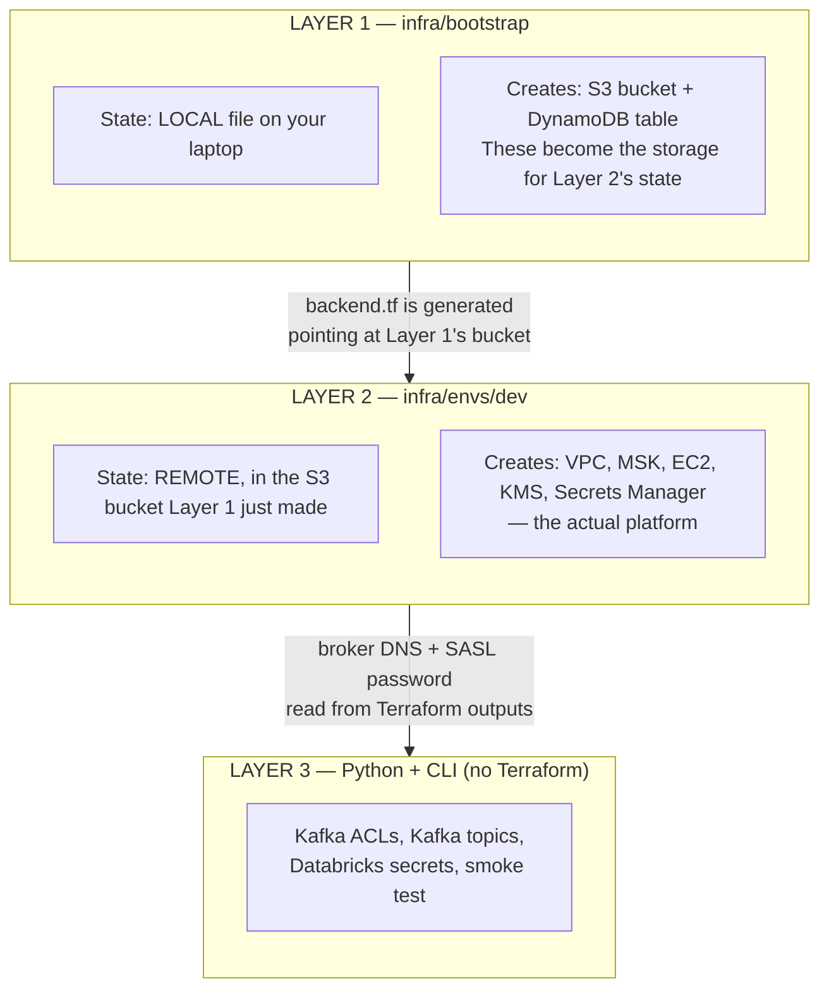
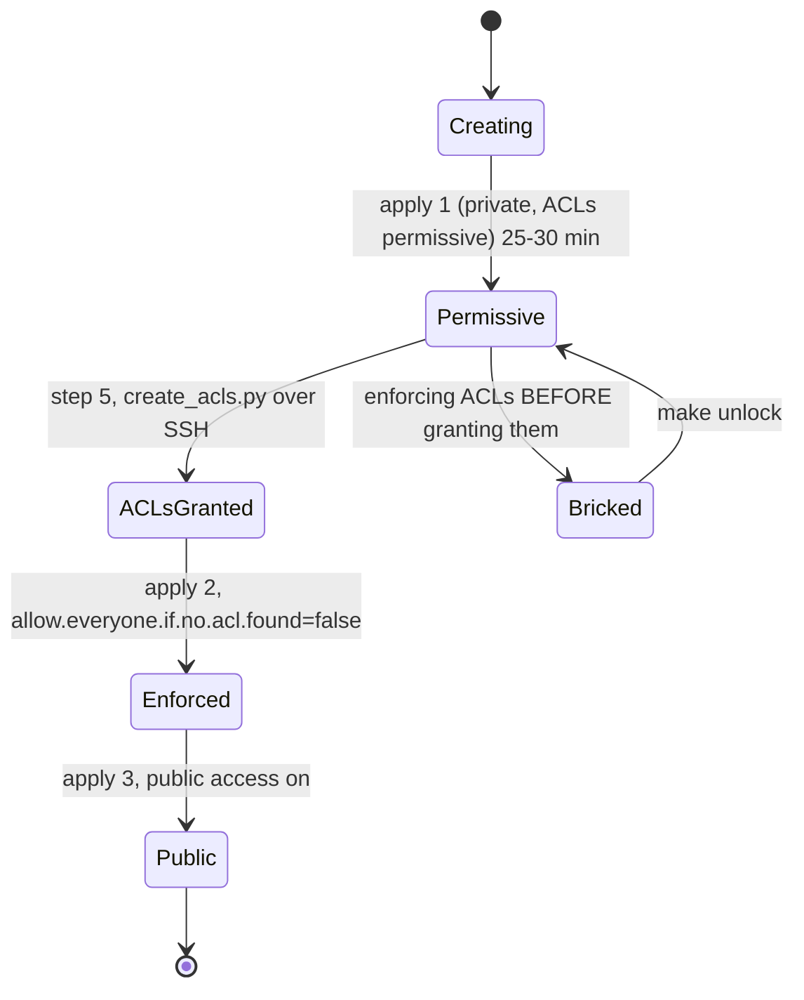

# What `make up` Builds — A Beginner's Walkthrough

Written for someone new to Terraform and AWS. It explains **every AWS resource
`make up` creates**, **what each one is for**, **what happens in what order**,
and **how to tell it worked**.

Companion docs, so this one doesn't repeat them:

- [`KAFKA_EXPLAINED.md`](KAFKA_EXPLAINED.md) — Kafka itself, for the same audience
- [`ARCHITECTURE.md`](ARCHITECTURE.md) §2 — the physical topology diagram
- [`SETUP.md`](SETUP.md) §5f — the full reasoning behind the MSK/ACL ordering
- [`SETUP.md`](SETUP.md) §7b — the condensed command sequence

---

## 1. Five Terraform concepts you need first

If you already know Terraform, skip to §2.

**A resource is one thing in AWS.** `aws_vpc`, `aws_instance`, `aws_msk_cluster`.
You describe what you want in `.tf` files; Terraform figures out the API calls.

**`terraform apply` makes reality match the files.** It compares what you wrote
against what exists, then creates, changes, or deletes to close the gap. Running
it twice with no file changes does nothing the second time — that property is
called *idempotence*, and this project leans on it heavily.

**State is Terraform's memory.** A JSON file mapping "the `aws_vpc` I called
`this`" to "vpc-0abc123 in AWS". Without it, Terraform can't tell *"create a new
VPC"* from *"the VPC I made yesterday still exists."* Lose the state and
Terraform forgets it owns your resources — normally a disaster. Here it isn't,
and §3 explains why.

**A module is a reusable folder of resources.** `infra/modules/network/` is a
module; `infra/envs/dev/main.tf` calls it. Think function call: inputs are
`variable`s, return values are `output`s.

**Some changes force replacement.** Most attributes can be edited in place. A
few can't — changing them means AWS destroys and recreates the resource. Terraform
calls this *ForceNew*, and it shows up in plans as `# forces replacement`. Two
resources here are marked ForceNew in the code comments, and knowing which
explains why `make up` is structured the way it is.

---

## 2. The shape of the whole thing

`make up` runs one script — [`scripts/bootstrap.sh`](../scripts/bootstrap.sh) —
which drives **two separate Terraform layers** plus some Python.



**Why two layers?** A chicken-and-egg problem. Terraform state should live in S3
so it's durable and lockable — but *something* has to create that S3 bucket, and
that something needs its own state. Layer 1 solves it by keeping its state in a
**local file**, because Layer 1's only job is to create Layer 2's storage.

---

## 3. Layer 1 — the state backend (5 resources)

```bash
terraform -chdir=infra/bootstrap apply
```

| Resource | What it is | Why it's here |
|---|---|---|
| `aws_s3_bucket.state` | Object storage bucket, named `fdai-tfstate-<your-account-id>` | Holds Layer 2's state file. Account ID is appended because S3 bucket names must be globally unique across all AWS customers |
| `aws_s3_bucket_versioning` | Keeps every previous version of each file | If a state write corrupts, you can roll back. Cheap insurance |
| `aws_s3_bucket_server_side_encryption_configuration` | AES256 encryption at rest | State files contain secrets in plaintext — including the Kafka password |
| `aws_s3_bucket_public_access_block` | Four separate "no public access" switches | Defence in depth. See the previous row for why |
| `aws_dynamodb_table.lock` | Key-value table `fdai-tflock`, billed per request | The **lock**. Two `terraform apply`s at once would corrupt state; each grabs a row here first, so the second waits |

`force_destroy = true` on the bucket means `make down` can delete it even with
files inside. Normally dangerous; here it's required, because the bucket always
contains a state file when you tear down.

### The bit that looks like a bug and isn't

Layer 2's state lives in S3 **inside the same account that gets wiped every 7
days.** Losing Terraform state is usually catastrophic — you get orphaned
resources nobody's tracking, and a bill for them.

Here the loss is **atomic with the resources.** The wipe deletes the state *and*
everything it described, at the same instant. State and reality stay consistent,
both empty. So the weekly wipe is just `make up` again.

---

## 4. Layer 2 — the platform (19 AWS resources + 4 local)

```bash
terraform -chdir=infra/envs/dev apply
```

### 4a. Networking — 9 resources ([`modules/network`](../infra/modules/network/main.tf))

| Resource | Count | What it is | Why |
|---|---|---|---|
| `aws_vpc` | 1 | A private network, `10.42.0.0/16` (~65k addresses) | Everything else lives inside it. DNS hostnames enabled because MSK's broker endpoints are DNS names |
| `aws_internet_gateway` | 1 | The VPC's door to the internet | Without it nothing inside can reach Binance or Coinbase |
| `aws_subnet.public` | **2** | Address ranges `10.42.0.0/24` and `10.42.1.0/24`, one per availability zone | **MSK requires at least 2 AZs.** An AZ is a physically separate datacentre; spreading brokers across two means one failing doesn't kill Kafka |
| `aws_route_table` | 1 | Rule saying "traffic to `0.0.0.0/0` → internet gateway" | A subnet with no route to the IGW is private regardless of the IGW existing |
| `aws_route_table_association` | **2** | Attaches that rule to each subnet | One per subnet |
| `aws_security_group.msk` | 1 | Firewall for the brokers | See below |
| `aws_security_group.producer` | 1 | Firewall for the EC2 box | See below |

A **security group** is a stateful firewall attached to a resource. `ingress` =
inbound, `egress` = outbound. Default is deny-all inbound, so every rule is an
explicit exception.

```
SG: msk
  IN   port 9196  from kafka_client_cidrs   ← public Kafka (Databricks NAT EIP + your IP)
  IN   port 9096  from 10.42.0.0/16         ← in-VPC Kafka (the EC2 producer)
  OUT  everything

SG: producer
  IN   port 22    from operator /32         ← ONLY created if operator_cidrs is set
  OUT  everything                           ← how it reaches exchanges + Kafka
```

Two ports because MSK exposes SASL/SCRAM on **9096 inside the VPC** and **9196
publicly**. They're different endpoints with different DNS names, and this trips
people up constantly.

The SSH rule is `dynamic` — a Terraform block that creates **zero or one** copies
depending on a condition. With no `operator_cidrs`, no SSH rule exists at all and
the host is egress-only. `bootstrap.sh` passes your current IP, detected fresh
each run via `curl https://checkip.amazonaws.com`, so a laptop that changed
networks can't leave a stale `/32` behind.

### 4b. Kafka — 8 AWS resources ([`modules/kafka_msk`](../infra/modules/kafka_msk/main.tf))

| Resource | What it is | Why |
|---|---|---|
| `aws_kms_key` | Your own encryption key, auto-rotating | Encrypts the SCRAM secret. A *customer-managed* key rather than the AWS default because the secret policy needs to grant the MSK service access |
| `aws_kms_alias` | Friendly name `alias/fdai-msk-scram` | Key IDs are UUIDs; aliases are readable |
| `aws_secretsmanager_secret` | Secret named `AmazonMSK_fdai_producer` | **The `AmazonMSK_` prefix is mandatory** — MSK refuses any other name |
| `aws_secretsmanager_secret_version` | The actual `{username, password}` JSON | Password is generated by `random_password`, 32 chars, never typed by a human |
| `aws_secretsmanager_secret_policy` | Policy allowing `kafka.amazonaws.com` to read it | **This is the no-IAM-roles workaround.** A *resource* policy is attached to the secret and grants a service access. An *IAM role* would be a separate identity — and this sandbox forbids creating those |
| `aws_msk_configuration` | Broker settings, holding one property | `allow.everyone.if.no.acl.found`. §5 explains why this exists |
| `aws_msk_cluster` | **The Kafka cluster.** 2× `kafka.t3.small`, 50 GB EBS each, Kafka 3.6.0, SASL/SCRAM only, TLS in transit and at rest | The thing everything else exists to support |
| `aws_msk_scram_secret_association` | Links the secret to the cluster | Until this exists, the cluster has no valid credentials |

Two details worth understanding:

`recovery_window_in_days = 0` on the secret. Secrets Manager normally keeps
deleted secrets for 7–30 days, and the **name stays reserved** during that
window. On a weekly rebuild cycle that would make the second `make up` fail with
"secret already exists." Zero means immediate deletion.

`random_id.config` appends a random suffix to the MSK configuration name. Same
class of problem: a deleted MSK configuration sits in `DELETING` for a while with
its name still taken. The suffix is stored in state, so it stays *stable* across
applies — which matters because the configuration name is ForceNew, and a rename
would replace your whole Kafka cluster.

### 4c. Producer host — 1 AWS resource ([`modules/producer_host`](../infra/modules/producer_host/main.tf))

| Resource | What it is |
|---|---|
| `aws_instance.producer` | One `t3.small` EC2 VM, Amazon Linux 2023, public IP, 20 GB encrypted root disk |

Two things to know:

**`iam_instance_profile` is `null`.** An instance profile normally gives a VM an
identity so it can call AWS APIs without credentials. This sandbox can't create
IAM roles, so the box has **no AWS identity at all.** It's why the git repo must
be public — the VM can't authenticate to a private one.

**`user_data` is a startup script**, rendered from
[`user_data.sh.tftpl`](../infra/modules/producer_host/user_data.sh.tftpl) with the
broker DNS and password baked in. On first boot it installs Docker and git,
clones the repo, writes `.env`, builds the image, and runs the container. Then:

```bash
touch /opt/fdai/ready     # last line, deliberately
```

The script uses `set -e`, so **any earlier failure means this file never
appears.** `bootstrap.sh` polls for it over SSH instead of sleeping a fixed
duration — the file's presence is real evidence the build finished, where a
`sleep 300` would just be a guess.

### 4d. SSH key — 1 AWS + 3 local

| Resource | Where | What |
|---|---|---|
| `tls_private_key.producer` | local | RSA 4096 keypair, generated fresh each run |
| `aws_key_pair.producer` | AWS | Uploads the public half so EC2 accepts it |
| `local_sensitive_file.producer_key` | your disk | Writes `infra/envs/dev/.ssh/fdai-producer.pem`, mode `0600`, gitignored |

Generated rather than reused because the account is wiped weekly — a hand-managed
key is one more thing to recreate every cycle. It grants shell on a host that
holds nothing the Terraform state doesn't already hold in plaintext.

---

## 5. Why the cluster is applied three times

This is the one genuinely confusing part of `make up`, and it's forced by AWS,
not chosen.



The happy path runs left to right. The branch to `Bricked` is the one failure
worth knowing about: enforce before granting and the cluster denies every client,
including the tool that would repair it.

The chain of constraints:

1. AWS **rejects public access** while a cluster is still `CREATING`. So it can't be part of apply #1.
2. AWS **rejects public access** unless `allow.everyone.if.no.acl.found=false`.
3. That setting makes Kafka **deny-by-default** — every client is refused unless an ACL permits it.
4. Creating an ACL **requires an ACL** permitting it (`Alter` on the cluster). Enforce before granting, and you've locked out even the tool that would fix it.
5. So ACLs must be granted **while still permissive** — but ACLs can only be written over a **reachable broker**, and before public access the only reachable endpoint is the in-VPC one (port 9096).
6. The EC2 producer host is the only thing inside the VPC. **Hence the SSH rule** — it exists for exactly one step.

Steps 2 and 3 can't be merged into a single apply, because within one update the
AWS provider changes connectivity *before* configuration — the wrong order. It'd
try public access first and fail exactly as it does with no configuration at all.

**If a run dies between steps 5 and 7**, you may have an enforced cluster with no
ACLs, which denies everything. That's what `make unlock` is for: one apply that
loosens both settings. It works in one shot precisely *because* the provider does
connectivity before configuration — wrong order for locking down, right order for
backing out.

---

## 6. The 8 steps, and what you'll see

| # | What it does | Time (first run) | How it knows it worked |
|---|---|---|---|
| 1 | Layer 1 apply — S3 + DynamoDB | ~30 s | Terraform outputs the bucket name |
| 2 | Generates `backend.tf` from a template, detects your public IP | instant | Prints `operator IP x.x.x.x/32` |
| 3 | Checks whether a previous run already finished; Layer 2 apply (MSK private, permissive) | **~25–30 min** | Terraform reports resources created |
| 4 | Waits for the producer host to finish building | 3–8 min | Polls `/opt/fdai/ready` over SSH every 15 s, times out at 900 s |
| 5 | Grants Kafka ACLs from inside the VPC | ~10 s | `create_acls.py` re-reads the ACLs and prints `VERIFIED` |
| 6 | Enforces ACLs (`allow.everyone...=false`) | several min | Terraform reports the config revision |
| 7 | Enables public access, then polls for the endpoint | several min | Polls `aws kafka get-bootstrap-brokers` until non-empty |
| 8 | Creates topics, restarts producer, writes Databricks secrets, smoke test | ~2–3 min | Smoke test prints `SMOKE OK: N live trades decoded` |

**Budget 45–60 minutes on the first run**, which is the figure to trust —
per-step times vary and the ones above are indicative, not guarantees. Steps 3,
6, and 7 are three separate MSK cluster operations and AWS runs them serially, so
the total is dominated by whatever mood AWS is in. The README's original "under 20
minutes" target predates the ACL requirement.

Three details in step 8 that look odd:

**The producer is restarted.** It's been running since step 4, failing against
topics that didn't exist yet. librdkafka only refreshes metadata for an unknown
topic every few minutes, so restarting is faster than waiting that out.

**Then a 90-second sleep** before the smoke test, to let the producer reconnect
and start publishing.

**Step 7 polls the AWS CLI rather than trusting Terraform's output.** The provider
reads the public broker string exactly once, the instant the connectivity update
finishes, and AWS doesn't always have the endpoint ready by then. So
`bootstrap_brokers_public` can be empty in state even though the apply reported
success — the script polls the API directly instead.

### Re-running after a failure

If step 8 fails for an unrelated reason, `make up` is **safe to re-run.** Step 3
first asks AWS whether the cluster is already public. If it is, the script asserts
the finished state directly and skips steps 6–7, rather than walking back through
"permissive" — which would try to loosen ACL enforcement while public access is
still on, and AWS refuses that for the same reason it refuses the reverse.

---

## 7. What you have when it finishes

```
Ready.
  public brokers : b-1-public...:9196,b-2-public...:9196
  in-VPC brokers : b-1...:9096,b-2...:9096
  producer host  : 54.x.x.x
  producer shell : ssh -i infra/envs/dev/.ssh/fdai-producer.pem ec2-user@54.x.x.x
```

Running, in AWS:

- **24 AWS resources** — 5 in Layer 1, 19 in Layer 2
- **An MSK cluster** with **11 topics** (see [`create_topics.py`](../scripts/create_topics.py)): `md.trades.v1`, `md.book.top.v1`, `md.book.depth.v1`, `md.bars.v1`, `news.articles.v1`, `ops.metrics.v1`, and 5 `_dlq.*`
- **An EC2 box** running a Docker container streaming Binance + Coinbase trades
- **Three secrets in Databricks** (`kafka_bootstrap`, `kafka_username`, `kafka_password`) — rewritten every run, because broker DNS changes on every rebuild

**Only `md.trades.v1` actually receives data.** The other 10 topics are
provisioned but empty — no producer code exists for them yet. This is expected,
not a failure; see [`ARCHITECTURE.md`](ARCHITECTURE.md) §3.

Verify independently:

```bash
make smoke                                    # re-run the smoke test
aws kafka list-clusters --region ap-southeast-1
databricks secrets list-secrets fdai --profile <your-profile>
ssh -i infra/envs/dev/.ssh/fdai-producer.pem ec2-user@<ip> 'sudo docker logs --tail 20 fdai-producers'
```

---

## 8. Cost, and why `make down` doesn't zero your bill

Charged **per hour while running** — these stop when you tear down:

| Item | Rough rate |
|---|---|
| MSK, 2× `kafka.t3.small` | ~$0.09–0.11/hr |
| MSK storage, 2× 50 GB | ~$0.015/hr equivalent |
| EC2 `t3.small` | ~$0.02–0.03/hr |
| Public IPv4 addresses (2 brokers + 1 EC2) | ~$0.005/hr each |

Charged **monthly regardless of uptime**:

| Item | Rate | Note |
|---|---|---|
| KMS customer-managed key | ~$1/month | **Survives `make down` for 7 days** — see below |
| Secrets Manager secret | ~$0.40/month | Deleted immediately (`recovery_window_in_days = 0`) |

Rates vary by region and change over time; treat these as order-of-magnitude and
check the AWS pricing pages for actual numbers. At ~30 h/week the design spec
estimates **~$15/month** for Account A.

**The gotcha:** `aws_kms_key` has `deletion_window_in_days = 7`. AWS enforces a
mandatory 7–30 day waiting period before a KMS key is actually destroyed, and
**you're charged for the key during that window.** So `make down` does not
immediately stop all charges, and a weekly `make rebuild` cycle can leave several
keys pending deletion at once. It's small money, but it's the kind of thing that
makes a bill confusing if you don't know to expect it.

---

## 9. When it goes wrong

| Symptom | Likely cause | Fix |
|---|---|---|
| Hangs at step 4, then times out at 900 s | `user_data` failed — usually the git clone | `ssh ... 'sudo cat /var/log/cloud-init-output.log'` (the script prints this command for you) |
| Every Kafka client gets an auth error | ACLs enforced before they existed | `make unlock` |
| Step 7 times out after 300 s | MSK never published the public endpoint | `aws kafka get-bootstrap-brokers --cluster-arn <arn>` |
| `make up` fails on MSK quota | Fresh sandbox accounts sometimes cap broker count | Service Quotas → MSK, request an increase ([`SETUP.md`](SETUP.md) §2) |
| Smoke test fails but everything else worked | Producer hadn't reconnected in 90 s | `make smoke` again |
| `note: state backend in X, stack in Y` | `AWS_REGION` disagrees with `terraform.tfvars` | `export AWS_REGION=<the tfvars region>` |

The one thing to internalise: **`make up` is safe to re-run.** Terraform applies
are idempotent, `create_topics.py` and `create_acls.py` skip work already done,
and step 3 detects a finished cluster and adapts. When in doubt, run it again
before reaching for anything more drastic.
