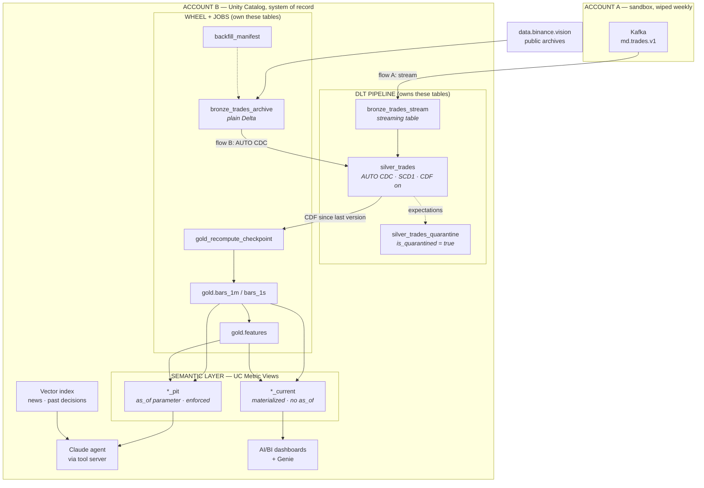
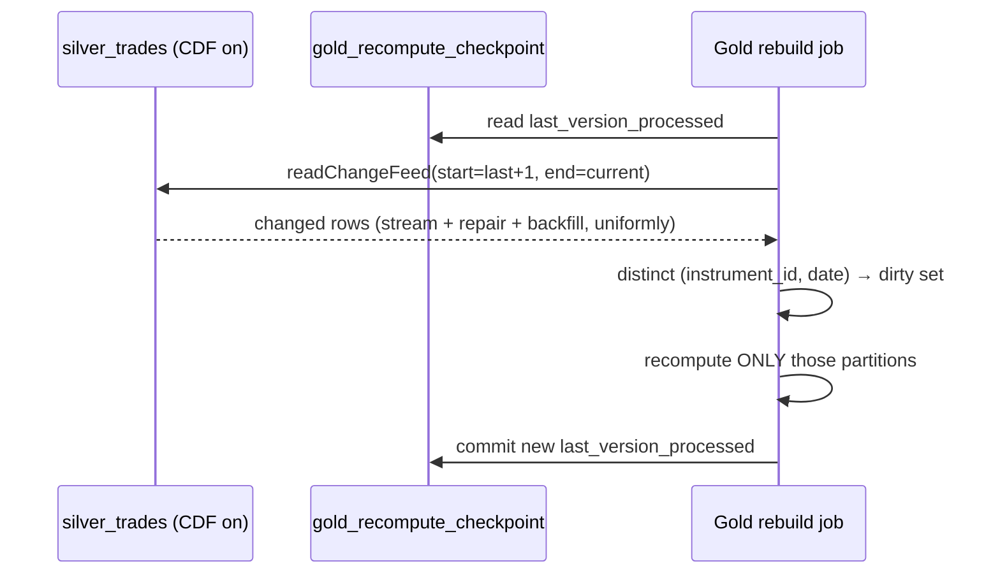
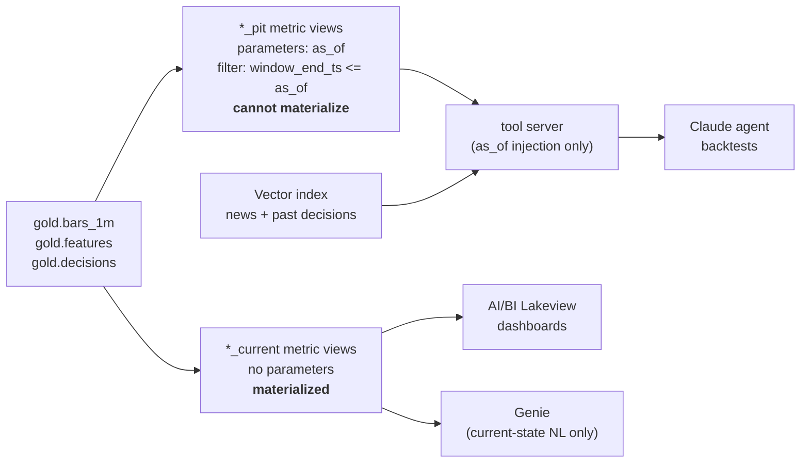

# Data Layer — Batch, Historical Enablement, and Serving — Design

**Date:** 2026-08-08
**Status:** Draft for review
**Parent spec:** [`2026-08-07-finance-data-ai-platform-design.md`](2026-08-07-finance-data-ai-platform-design.md)
**Covers:** build-order stages 2 and 3, plus the serving contracts stage 6 will consume.

This is a **contracts spec**. It pins the shape of the data layer end to end — tables,
ownership, point-in-time semantics, and both serving surfaces — so that Gold is designed
against what actually consumes it. It does **not** decompose into a single implementation
plan; §12 splits it into six.

## 1. Why this document exists

The parent spec sketches Bronze→Silver→Gold in prose. Two things in that sketch do not
survive contact with the batch layer, and one thing it never addressed at all.

### 1.1 Correction — the watermark contradiction

Parent spec §6 says Silver is *"deduplicated on natural key with a 10-minute watermark"*
and, twenty lines later, that archive backfill lands in Bronze and *"same natural key →
dedupe → converges with live data."*

These are incompatible. Binance publishes daily archives next-day, so archive rows are
hours-to-days late. A 10-minute watermark drops every one of them, and the reconciliation
job then reports a discrepancy it can never close — a permanently red check with no bug to
find.

**Resolution:** Silver is a keyed-upsert target, not a watermarked streaming dedupe. There
is no lateness cutoff at all.

### 1.2 Correction — the archive that must be chosen

`data.binance.vision` publishes both `trades/` and `aggTrades/`. The live connector emits
**aggTrade** records specifically because `/api/v3/aggTrades?fromId=` allows keyless
exact-range gap repair. Backfilling from `trades/` would produce rows whose ids live in a
different id space, dedupe would not converge, and **volume would double-count** — a
silent correctness failure that looks like unusually high liquidity, not like a bug.

The archive choice is load-bearing. It is stated here so it cannot be treated as
incidental.

### 1.3 Gap — nothing specified how AI and BI read the data

The parent spec lists agent tools and a dashboard, but never says where a metric is
*defined*. Left unspecified, `vwap` gets implemented once in a Python tool and again in a
dashboard query, and they drift. §7 closes this.

## 2. Decisions

| # | Decision | Rationale |
|---|---|---|
| D1 | Silver is an AUTO CDC keyed-upsert target | No lateness cutoff; archive backfill converges (§4.2) |
| D2 | DLT owns Bronze-stream→Silver; a wheel owns backfill and Gold | Pipelines own targets exclusively (§3.2) |
| D3 | Gold sits outside DLT, recomputed by scope | A materialized view over 2y full-refreshes on late data |
| D4 | History is tiered by granularity, not uniform | 2y of *bars* satisfies the backtest; 2y of *trades* does not fit the budget |
| D5 | Metric Views are the single metric definition | One definition for agent and BI; drift becomes impossible |
| D6 | Views split into `*_pit` (parameterized) and `*_current` (materialized) | Parameterized views cannot materialize; each family is honest about time |
| D7 | Recompute scope comes from Change Data Feed | Uniform across stream, repair, and backfill; no writer must remember to mark |

## 3. Topology and ownership

### 3.1 The map



### 3.2 Why three ownership domains

**DLT owns Bronze-stream → Silver.** Expectations, quarantine, and keyed dedupe are DLT's
genuine strengths, and this is the only place the design needs them.

**A wheel owns backfill and Gold.** Not preference — constraint. Pipelines own their
targets exclusively: *"Tables defined by a pipeline can't be changed or updated by any
other pipeline"* ([ldp/streaming-tables]). A backfill job therefore **cannot** MERGE into a
DLT Bronze table. Instead backfill writes `bronze_trades_archive` as plain Delta, and the
pipeline reads it as a **source** via a second named AUTO CDC flow into `silver_trades`
(§4.1). Ownership stays clean and backfill stays unit-testable under local `pytest`.

Gold is outside DLT for a different reason: a materialized view over a two-year window may
full-refresh when late data arrives, which makes the expensive case the common case. Gold
is plain Delta rebuilt by scope (§5).

**The semantic layer owns metric definitions.** Nothing below it defines a metric; nothing
above it redefines one.

### 3.3 Table inventory

| Table | Owner | Type | Notes |
|---|---|---|---|
| `bronze_trades_stream` | DLT | streaming table | Kafka metadata preserved; append-only |
| `bronze_trades_archive` | wheel job | Delta | `source = ARCHIVE`; pipeline reads as source |
| `silver_trades` | DLT | AUTO CDC target | `keys=(venue, trade_id)`, `sequence_by=event_ts_us`, CDF **on** |
| `silver_trades_quarantine` | DLT | streaming table | Expectation failures, never dropped |
| `backfill_manifest` | wheel job | Delta | Idempotency + resumability ledger |
| `gold_recompute_checkpoint` | wheel job | Delta | Last Delta version consumed from Silver CDF |
| `gold.bars_1m`, `gold.bars_1s` | wheel job | Delta | `CLUSTER BY (instrument_id, window_end_ts)` |
| `gold.features` | wheel job | Delta | Carries `as_of_ts` and `fidelity` |
| `ref.instruments` | wheel job | Delta | Venue symbol → canonical `instrument_id` |

## 4. Dedupe correctness

### 4.1 Mechanism

Two flows, one target. Multiple AUTO CDC flows may write the same target provided each
carries a distinct `name`:

```python
COMMON = dict(
    target="silver_trades",
    keys=["venue", "trade_id"],
    sequence_by="event_ts_us",
    stored_as_scd_type=1,
)

# flow A — live stream
dp.create_auto_cdc_flow(name="cdc_trades_stream",  source="bronze_trades_stream",  **COMMON)

# flow B — archive backfill, arriving days late by design
dp.create_auto_cdc_flow(name="cdc_trades_archive", source="bronze_trades_archive", **COMMON)
```

**Flow B must be an AUTO CDC flow, not `@dp.append_flow`.** An append flow is append-only
and applies no dedupe, so every archive row overlapping the live stream would land as a
second copy of a trade that is already there — doubling volume in exactly the window where
the reconciliation proof is supposed to demonstrate correctness.

### 4.2 Why SCD Type 1 is safe here — read this before changing it

The Databricks docs warn that under SCD Type 1, *"the last UPDATE operations arrive late
and are dropped from the target table"* ([ldp/cdc]). Read cold, that appears to break
backfill. It does not, and the reason must be understood before anyone "fixes" it.

A row is discarded only when the target already holds **that key** at a **strictly newer**
`sequence_by`. Our key is `(venue, trade_id)` and a trade is an **immutable fact**: the
stream copy and the archive copy of aggTrade `12345` carry the *same* exchange
`event_ts_us`. Sequence values **tie**; they never regress. And the two rows are
byte-identical, so which one wins is immaterial.

| Arrival case | Outcome | Occurs here? |
|---|---|---|
| Key absent | insert | Yes — normal path |
| Key present, older stored sequence | upsert | No — would require a trade's timestamp to change |
| Key present, newer stored sequence | **silently discarded** | No — ties, never regresses |

The doc's warning is about **mutable dimensions**. It does not bite append-only facts.

**Guard:** because this rests on immutability, a contract test asserts that no two rows
sharing `(venue, trade_id)` ever carry different `(event_ts_us, price, size)`. If that
invariant ever breaks, SCD Type 1 becomes lossy and the design must move to SCD Type 2.
The test is the tripwire.

## 5. Recompute by scope

Backfill invalidates bars that were already computed. Recomputing everything is
unaffordable; recomputing nothing is wrong.



Change Data Feed is the mechanism rather than a hand-maintained dirty list because **no
writer has to remember to mark anything**. Stream arrivals, REST gap repairs, and archive
backfill are all just commits to Silver, and all three are discovered identically. A manual
dirty list fails the first time someone adds a fourth writer and forgets. CDF is also
required on Gold for Vector Search on standard endpoints, so it is one mechanism, not two.

## 6. Historical enablement

### 6.1 Tiers

```text
        2 years ago            90d          30d         now
             |------------------|------------|-----------|
  deep  1m klines  ████████████████████████████████████████
  mid   1s klines                     ██████████████████████
  hot   aggTrades                                  █████████
                                                        ▲
                                        live stream continues from here
```

| Tier | Archive path (`.../data/spot/daily/`) | Window | Natural key | ~Rows |
|---|---|---|---|---|
| deep | `klines/{SYM}/1m/{SYM}-1m-{date}.zip` | 2 years | `(sym, open_time)` | ~8 M |
| mid | `klines/{SYM}/1s/{SYM}-1s-{date}.zip` | 90 days | `(sym, open_time)` | ~62 M |
| hot | `aggTrades/{SYM}/{SYM}-aggTrades-{date}.zip` | 30 days | `aggTradeId` | ~1–2 B |

Justified per tier by a consumer that needs it: the deep tier serves the two-year daily
backtest the parent spec sizes at ~5,000 decisions; the hot tier serves trade-level flow
features and the reconciliation proof. Total storage stays single-digit GB, comfortably
inside the stated $40–80/mo envelope.

**Coinbase has no public archive.** Backfill is Binance-only; Coinbase history begins when
streaming began. Since `ref.instruments` collapses both venues to one `instrument_id`, any
cross-venue aggregate **changes composition** at that boundary. `gold.bars_1m` therefore
carries `venue_coverage` so the change is visible in the data rather than discovered as an
anomaly six months later.

### 6.2 Loader contract

Idempotent and resumable via `backfill_manifest`:

```text
(venue, instrument_id, tier, dt, url,
 sha256_expected, sha256_actual, row_count,
 status ∈ PENDING|RUNNING|DONE|FAILED|SKIPPED_NO_DATA,
 attempt, started_ts, completed_ts, error)
```

A run skips `DONE` partitions. Every archive file has a sibling `.CHECKSUM`; verifying it
is what makes `DONE` trustworthy enough to skip — an unverified skip is just an assumption
with a timestamp.

### 6.3 Two parsing traps

**`isBuyerMaker` inverts.** `isBuyerMaker = true` means the *buyer* was the maker, so the
aggressor is the **seller** → `side = SELL`. Getting this backwards flips every
flow-imbalance feature, and no downstream check would catch it — the data stays
well-formed, merely wrong.

**Timestamp units are not constant across the range.** Binance changed archive timestamps
from milliseconds to microseconds partway through the window this design backfills. The
loader must **detect** the unit per file by magnitude against a sane epoch bound and
normalize to microseconds. Assuming either unit puts part of the history off by 1000×.

Both get golden-file unit tests, matching the connector testing culture already in the
repo.

### 6.4 Fidelity — the tier boundary is a backtest bias

At any `as_of` older than 30 days there are no trades, only bars. Flow imbalance remains
computable — 1m klines carry `takerBuyBaseVolume` — but at bar granularity rather than
trade granularity.

Every `gold.features` row therefore carries **`fidelity ∈ {EXACT, DERIVED}`**.

Without it, a two-year backtest silently mixes high-fidelity recent features with
lower-fidelity older ones, and the model appears to improve over time when all that
improved is the input data. The eval harness asserts fidelity consistency across a backtest
window; a mixed window is a **finding to report**, not a warning to suppress.

### 6.5 Reconciliation, scoped honestly

`gold.bars_1m` carries `source_tier ∈ {DERIVED_FROM_TRADES, ARCHIVE_KLINE}`.

Within the 30-day hot window both exist for the same bars, and **that overlap is the
reconciliation** — stream-derived OHLCV against Binance's published klines, against the
parent spec's `< 0.01%` discrepancy SLO. Outside that window the bars *are* the klines, so
comparing them would be self-comparison dressed as a correctness proof.

The nightly job reports **discrepancy and coverage together**. A pass over zero comparable
bars must read as *"no evidence,"* never as *"correct."* A green check that cannot fail is
worse than no check, because it is trusted.

## 7. Serving

### 7.1 The split



`*_pit` enforces anti-lookahead **in the semantic layer itself**:

```yaml
version: 1.1
source: catalog.gold.bars_1m
parameters:
  - name: as_of
    data_type: timestamp
filter: window_end_ts <= as_of
fields:
  - name: instrument_id
    expr: instrument_id
measures:
  - name: vwap
    expr: SUM(notional) / SUM(volume)
  - name: realized_vol
    expr: SQRT(SUM(sq_log_return))
```

Called as a table-valued function:

```sql
SELECT instrument_id, MEASURE(vwap), MEASURE(realized_vol)
FROM catalog.gold.bars_1m_pit(as_of => TIMESTAMP'2026-08-01 00:00:00')
GROUP BY ALL
```

This is **stronger than the parent spec's tool-layer enforcement**. There, a new tool that
forgot to filter would leak the future. Here the view physically cannot return it, no
matter who queries.

### 7.2 Measures must be additively decomposable

A metric view measure is re-evaluated at whatever grain the caller groups by, so it must be
expressible as an aggregate over stored columns. This constrains Gold's schema:

| Metric | Wrong | Right | Gold must store |
|---|---|---|---|
| VWAP | `AVG(vwap)` | `SUM(notional)/SUM(volume)` | `notional`, `volume` |
| Realized vol | `AVG(realized_vol)` | `SQRT(SUM(sq_log_return))` | `sq_log_return` per bar |
| Flow imbalance | `AVG(imbalance)` | `(SUM(buy_vol)-SUM(sell_vol))/SUM(volume)` | `buy_vol`, `sell_vol` |

Storing a precomputed `vwap` and averaging it is wrong at every grain except the one it was
computed at, and it fails *quietly*. Gold stores the numerators and denominators; the
semantic layer does the division. This also sidesteps metric-view windowed measures, whose
support for `STDDEV` is undocumented.

### 7.3 Agent tools stay named and typed

The parent spec's tool surface (`get_price_context`, `get_features`, …) is **kept as the
agent's interface** — narrow typed tools are easier for a model to use correctly and easier
to evaluate than one generic query tool. What changes is the implementation: each tool
becomes a thin wrapper emitting `MEASURE()` queries against a `*_pit` view, injecting
`as_of` into the TVF call.

The tool server holds **no aggregation logic**. It marshals parameters and injects `as_of`.
Enforcement then exists twice — wrapper and view filter — which is defense in depth, not
redundancy.

Two tools remain non-metric and read the vector index: `get_news` and `search_history`.

### 7.4 Genie is restricted to `*_current`

Whether Genie can supply values to a parameterized metric view is **undocumented**. If
Genie were pointed at a `*_pit` view it could silently receive the default `as_of` — a
lookahead leak that raises no error.

Genie is therefore granted access to `*_current` views only, enforced by UC grants rather
than convention. "Current state" is the one context where `as_of = now` is correct, so the
restriction costs nothing real.

### 7.5 BI

AI/BI Lakeview dashboards bind datasets directly to `*_current` views by `asset_name`; the
YAML-defined measures are already queryable and must not be redeclared. Note that a
metric-view-backed dataset **cannot have its query edited to filter or exclude columns** —
dashboard filtering uses filter widgets bound to dimensions.

Panels: positions and simulated P&L, decision log with rationale and outcome, data-quality
and quarantine rate, pipeline latency, spend — plus three this design adds: **backfill
coverage**, **reconciliation discrepancy with coverage**, and **fidelity mix**.

### 7.6 Vector index

Delta Sync index with managed embeddings, `pipeline_type = TRIGGERED` to match the batch
cadence. Requires Change Data Feed on the source tables and serverless.

**Corpus availability is not symmetric, and stage 3d must not assume it is.**
`gold.decisions` is produced by the agent itself (parent spec stage 5). `silver.news` does
not exist and **cannot** exist yet: `news.articles.v1` is a provisioned topic with **no
producer and no Avro schema** — nothing has ever been written to it. Indexing news
therefore depends on a stage-1 extension (news connector + `news.v1.avsc`) that is outside
this spec. Stage 3d ships the index over whichever corpora exist at the time and treats
news as an additive follow-on, not a precondition.

The endpoint lives in **Account B**, which is permanent — so unlike everything in the
sandbox, it is created once and never rebuilt. Endpoints are immutable after creation, so
the type choice (`STANDARD`) is a one-way door; `STORAGE_OPTIMIZED` is unwarranted at this
corpus size.

## 8. Testing

| Layer | What |
|---|---|
| Unit (local `pytest`) | Archive parsers against committed golden CSV fixtures; `isBuyerMaker` → side; timestamp-unit detection; additive measure math |
| Contract | Every `*_pit` view YAML declares an `as_of` parameter — asserted by parsing YAML in CI, not by review |
| Contract | Immutability tripwire: no two rows share `(venue, trade_id)` with differing `(event_ts_us, price, size)` (§4.2) |
| Integration | Local Spark: archive → Bronze → Silver → Gold; assert stream/archive overlap converges to one row per trade |
| Lookahead | Inject a future row; assert `*_pit` at an earlier `as_of` excludes it. **The test must fail if the guard is removed** — now assertable at the view level, not just the tool level |
| Data quality | DLT expectation metrics; quarantine rate; nightly reconciliation with coverage |
| Infra | `databricks bundle validate` in CI |

The lookahead-injection test carries over from parent spec §12 and gets meaningfully
stronger: it now proves a property of the *data layer*, not of one code path.

## 9. Observability

Added to the parent spec's SLI table:

| SLI | Target |
|---|---|
| Backfill coverage (partitions `DONE` / expected) | 100% per tier window |
| Reconciliation discrepancy | < 0.01% of comparable bars |
| Reconciliation **coverage** | > 0 comparable bars, else "no evidence" |
| Fidelity mix within a backtest window | homogeneous, else reported |
| Dirty-partition backlog (Silver version lag) | bounded and trending to zero |
| Quarantine rate | < 0.1% of records |

## 10. Cost

Tiered history is what keeps this inside budget: single-digit GB rather than the ~150–200 GB
compressed that uniform trade-level history over two years would require.

- Triggered pipeline, not continuous.
- Gold recompute scoped to dirty partitions — a backfill of one symbol-day rebuilds one
  symbol-day.
- `*_current` materialization needs serverless; the refresh is small because it is bar-grain.
- `*_pit` **cannot** materialize, so every agent query scans Gold. Mitigated by
  `CLUSTER BY (instrument_id, window_end_ts)` — liquid clustering rather than date
  partitioning, since queries filter on both instrument and time.

## 11. Assumptions to verify

Design proceeded without a working Databricks connection (CLI v0.280.0 below the required
v0.292.0; all eight profiles reported `Valid = NO`). Each assumption below has a named
fallback, following the parent spec's §2 pattern.

| # | Assumption | Fallback if false |
|---|---|---|
| A1 | Unity Catalog enabled | `hive_metastore`; lose Metric Views → metrics move into the tool server, BI reads Gold directly |
| A2 | DBR 17.3+ for metric views with semantic metadata | 16.4+ still supports creation; lose Genie synonyms |
| A3 | Metric view `parameters` available | `*_pit` becomes a plain view with a static filter per as_of, or enforcement falls back to the tool server only |
| A4 | Serverless enabled | Lose `*_current` materialization and Vector Search; views become non-materialized, RAG moves to a Delta-table keyword search |
| A5 | AUTO CDC available (edition ADVANCED or serverless) | Hand-written `MERGE` in the wheel; Silver leaves DLT |
| A6 | CDF readable on an AUTO CDC target | Fall back to an explicit `dirty_partitions` table written by each writer |
| A7 | Genie cannot pass metric-view parameters | Already assumed false-safe: Genie is restricted to `*_current` (§7.4) |
| A8 | `dbutils.secrets.get` works in serverless DLT | UC service credential via `databricks.serviceCredential` |
| A9 | DAB `periodic.unit: MINUTES` valid | Use `schedule.quartz_cron_expression` — **preferred regardless**, since `MINUTES` is unconfirmed |
| A10 | Kafka JAAS needs the `kafkashaded.` class prefix | Confirmed required on Databricks; unshaded names fail with `RESTRICTED_STREAMING_OPTION_PERMISSION_ENFORCED` |

A1 and A5 are the only two that would force a structural redesign. The rest degrade
gracefully.

## 12. Decomposition into implementation plans

Each stage is independently demoable and gets its own plan.

| # | Stage | Ships | Depends on |
|---|---|---|---|
| 2a | Bronze + Silver DLT pipeline | Kafka → Bronze → Silver with expectations, quarantine, AUTO CDC dedupe | — |
| 2b | Gold bars + CDF recompute | `gold.bars_1m/1s`, scoped rebuild, checkpoint | 2a |
| 3a | Backfill tiers + manifest | Three-tier archive loader, checksum-verified, resumable | 2a |
| 3b | Features + fidelity | `gold.features` with `as_of_ts`, `fidelity`, additive components | 2b, 3a |
| 3c | Semantic layer + BI | `*_pit` / `*_current` views, Lakeview dashboard | 3b |
| 3d | Vector index + tool rewire | RAG over news and decisions; tools emit `MEASURE()` queries | 3c |

**Reconciliation (§6.5) belongs to 3a**, not 2b — it is meaningless until archive klines
exist to compare against. Attempting it in 2b produces the vacuous green check §6.5 warns
about.

## 13. Rejected alternatives

- **Full DLT end to end, Gold as materialized views.** Least code and best lineage, but a
  materialized view over a two-year window may full-refresh when late data arrives, making
  the expensive path the common one. Scoped recompute is the whole point of the batch layer.
- **All plain Jobs, no DLT.** One paradigm and fully local-testable, which is genuinely
  attractive given this repo's `make check` culture. Rejected because expectations,
  quarantine, and out-of-order-tolerant keyed dedupe would all be hand-built, and AUTO CDC's
  dedupe is the exact primitive this design needs.
- **Uniform aggTrades history for two years.** One lineage, zero tier logic, every feature
  recomputable from source. Rejected on cost: ~150–200 GB compressed and a backfill measured
  in days, against a ~$40–80/mo budget.
- **Split serving paths — feature store for AI, Gold for BI.** Each side tuned to its
  access pattern, but every metric defined twice, and nothing detects the drift.
- **API-mediated single chokepoint.** Strongest possible lookahead guarantee, but
  reimplements aggregation in Python and forfeits Lakeview, Genie, and DBSQL entirely.
- **Backfill MERGEing directly into DLT-owned Bronze.** Not a trade-off — prohibited.
  Pipelines own their targets exclusively.

[ldp/streaming-tables]: https://docs.databricks.com/aws/en/ldp/streaming-tables
[ldp/cdc]: https://docs.databricks.com/aws/en/ldp/cdc
