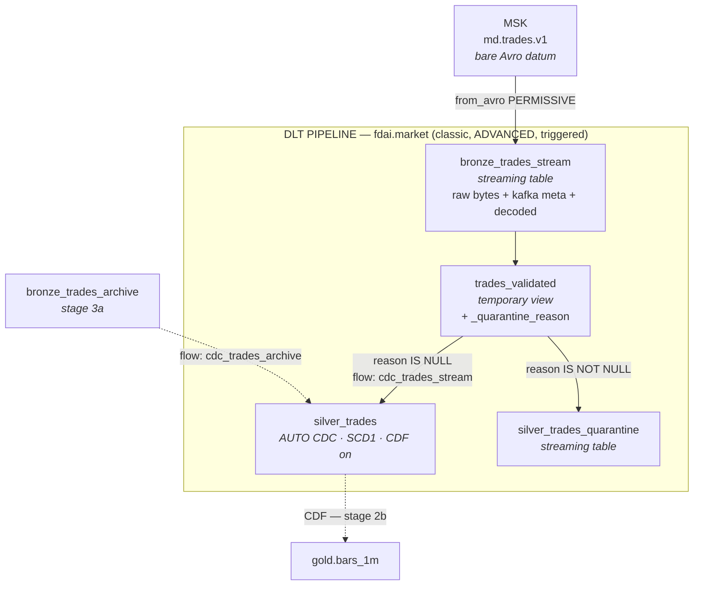

# Stage 2a — Bronze + Silver Pipeline — Design

**Date:** 2026-08-12
**Status:** Draft for review
**Parent spec:** [`2026-08-08-data-layer-batch-history-and-serving-design.md`](2026-08-08-data-layer-batch-history-and-serving-design.md)
**Covers:** stage 2a of the parent spec's §12 decomposition — the first Databricks code in the project.

The parent spec is a *contracts* spec: it pins table shapes, ownership, and dedupe
semantics across all of stages 2 and 3. This document decomposes the first of its six
stages into something buildable, and resolves the three places where the contract is
under-specified or slightly wrong.

## 1. Scope

**Ships:**

- `bronze_trades_stream` — streaming table reading `md.trades.v1` from MSK.
- `silver_trades` — AUTO CDC keyed-upsert target, SCD Type 1, Change Data Feed on.
- `silver_trades_quarantine` — streaming table holding every rejected record with a reason.
- A Declarative Automation Bundle that deploys the pipeline.
- A local `pytest` suite covering all transformation logic.

**Does not ship** (later stages, named so scope creep is visible): Gold bars, the archive
backfill flow, reconciliation, metric views, `ref.instruments`, the Kafka DLQ writer.

**Must not preclude:** Stage 3a adds a second AUTO CDC flow into the *same* `silver_trades`
target (parent §4.1). Stage 2a therefore gives its flow an explicit
`name="cdc_trades_stream"` from the first commit, so that adding `cdc_trades_archive` later
is purely additive rather than a rewrite of a working flow.

## 2. Corrections to the parent spec

### 2.1 Quarantine cannot work the way §4.1 and §3.3 jointly describe

Parent §4.1 shows the CDC flow reading Bronze directly:

```python
dp.create_auto_cdc_flow(name="cdc_trades_stream", source="bronze_trades_stream", **COMMON)
```

Parent §3.3 requires `silver_trades_quarantine` to hold *"expectation failures, never
dropped."* These are incompatible. A DLT expectation has exactly three behaviours, and none
of them routes a row to another table:

| Expectation | Effect on a violating row |
|---|---|
| `expect` | Passes through into the target. Counted, not quarantined. |
| `expect_or_drop` | Discarded before write. **Gone** — not quarantined. |
| `expect_or_fail` | Aborts the update. |

**Resolution.** Validation becomes an explicit branch, and the CDC flow reads the *valid*
branch rather than raw Bronze:

- Bronze ingests everything and rejects nothing.
- A temporary view derives a nullable `_quarantine_reason` column.
- Rows with `_quarantine_reason IS NULL` feed the AUTO CDC flow into `silver_trades`.
- Rows with a reason land in `silver_trades_quarantine`, carrying the reason *and* the raw
  Kafka bytes.
- Warn-only `expect_all` mirrors the same predicates so DLT still emits the expectation
  metrics that the parent spec's §9 quarantine-rate SLI is defined against.

"Never dropped" then holds literally, and a quarantined row says *why* it was quarantined —
which a boolean flag would not.

### 2.2 The pipeline edition is ADVANCED, not "Pro/Advanced"

Parent §11 assumption A5 records AUTO CDC as needing *"serverless or the `Pro`/`Advanced`
pipeline edition."* The edition matrix is stricter: CDC and SCD Type 1/2 require
**`ADVANCED`**. `PRO` does not include CDC. Expectations, by contrast, are available in every
edition — so the constraint comes entirely from AUTO CDC.

This does not change the parent's conclusion (classic compute satisfies it), only the exact
value written into the pipeline definition.

### 2.3 Silver must not carry Kafka metadata

Parent §4.2's correctness argument is that the stream copy and the archive copy of a trade
are interchangeable, so an SCD Type 1 tie can be broken either way. Kafka offset and
partition exist **only** for the stream copy. Carrying them into `silver_trades` would make
the two copies differ on a column, and the interchangeability argument would no longer hold
as written.

Kafka metadata therefore stays in Bronze, which is where parent §3.3 already places it
("Kafka metadata preserved" is listed as a `bronze_trades_stream` property). The CDC flow
excludes those columns via `except_column_list`.

`source` and `is_backfill` *do* differ between the two copies, and that is fine: §4.2's
tripwire deliberately asserts only on `(event_ts_us, price, size)`, so either copy winning
is immaterial.

## 3. Topology



Solid edges are Stage 2a. Dashed edges are the later stages this design must leave room for.

## 4. Bronze contract

`bronze_trades_stream` is append-only and never rejects a record. It is the forensic record
of what Kafka actually delivered.

| Column | Type | Source |
|---|---|---|
| `venue`, `venue_symbol`, `instrument_id`, `trade_id` | STRING | decoded Avro |
| `event_ts_us`, `ingest_ts_us` | BIGINT | decoded Avro |
| `price`, `size` | STRING | decoded Avro — still strings here |
| `side`, `source` | STRING | decoded Avro enums |
| `sequence` | BIGINT | decoded Avro, nullable |
| `is_backfill` | BOOLEAN | decoded Avro |
| `_kafka_value` | BINARY | raw datum, retained for forensics |
| `_kafka_key`, `_kafka_topic` | STRING | Kafka |
| `_kafka_partition`, `_kafka_offset` | INT / BIGINT | Kafka |
| `_kafka_timestamp` | TIMESTAMP | Kafka |
| `_ingested_at` | TIMESTAMP | `current_timestamp()` at read |

### 4.1 Decoding

The producer writes a bare Avro datum with no Confluent magic-byte prefix and no schema
registry ([`ingest/core/codec.py`](../../../ingest/core/codec.py)). That is exactly what
`from_avro(data, jsonFormatSchema)` consumes, so the consumer side needs no registry either.
The `.avsc` file is read from the repo — the same file the producer loads — which extends
codec.py's "drift is impossible by construction" property across the wire.

Decoding uses **`mode = "PERMISSIVE"`**. This is a deliberate availability decision:
`FAILFAST` (the default) aborts the entire micro-batch on a single malformed record, so one
poison record halts all ingestion indefinitely. PERMISSIVE yields a NULL struct instead, and
§5's `decode_failed` reason turns that into a quarantined row. Lossless and non-blocking.

### 4.2 Kafka read options

| Option | Value | Why |
|---|---|---|
| `subscribe` | `md.trades.v1` | from pipeline configuration, not a literal |
| `startingOffsets` | `earliest` | capture whatever is inside the 24h retention on first run |
| `failOnDataLoss` | `true` (default) | never silently skip data; see §9 for the post-wipe case |
| `maxOffsetsPerTrigger` | `1000000` | bounds micro-batch size across 6 partitions; tunable |
| `kafka.security.protocol` | `SASL_SSL` | MSK public listener |
| `kafka.sasl.mechanism` | `SCRAM-SHA-512` | matches the producer |
| `kafka.sasl.jaas.config` | `kafkashaded.org.apache.kafka.common.security.scram.ScramLoginModule` | parent §11 A10 — the unshaded class name fails on Databricks |

Credentials come from `dbutils.secrets.get("fdai", ...)`, already published by
[`scripts/bootstrap.sh`](../../../scripts/bootstrap.sh) as `kafka_bootstrap`,
`kafka_username`, `kafka_password`.

## 5. Validation and quarantine

`_quarantine_reason` is derived by a `CASE` chain — first match wins, so a row with two
problems reports the most fundamental one.

| Order | Reason | Predicate |
|---|---|---|
| 1 | `decode_failed` | decoded struct IS NULL |
| 2 | `missing_key` | `venue` or `trade_id` is NULL or empty |
| 3 | `missing_instrument` | `instrument_id` is NULL or empty |
| 4 | `bad_timestamp` | `event_ts_us` NULL, `< 1483228800000000`, or `> unix_micros(current_timestamp()) + 86400000000` |
| 5 | `bad_price` | `try_cast(price AS DECIMAL(38,18))` IS NULL or `<= 0` |
| 6 | `bad_size` | `try_cast(size AS DECIMAL(38,18))` IS NULL or `<= 0` |
| 7 | `bad_side` | `side NOT IN ('BUY','SELL','UNKNOWN')` |

**Why `missing_key` is not merely hygiene.** AUTO CDC keys cannot be NULL. A NULL `trade_id`
reaching the CDC flow is a pipeline error, not a data-quality warning, so it must be
diverted before the flow sees it.

**Why the timestamp bounds are the ms/µs tripwire.** Parent §6.3 records that Binance changed
archive timestamps from milliseconds to microseconds partway through the backfill window, and
that assuming either unit puts part of the history off by 1000×. The lower bound
(2017-01-01 in µs = `1483228800000000`) catches exactly that: a 2026 timestamp expressed in
milliseconds is ~`1.78e12`, three orders of magnitude below the floor. Placing the guard at
Silver's door means the bug is caught no matter which writer introduces it — not only inside
the Stage 3a archive loader where §6.3 anticipates it.

**`bad_side` is defence in depth.** An invalid Avro enum index fails decoding outright, so
this reason is near-unreachable from the Kafka path. It becomes reachable in Stage 3a, where
the archive loader derives `side` from `isBuyerMaker` — the inversion trap of parent §6.3.

`DECIMAL(38,18)` gives 18 fractional digits (below satoshi granularity) and 20 integral
digits (beyond any plausible price), so the cast is lossless for every instrument in
[`config/universe.yaml`](../../../config/universe.yaml).

## 6. Silver contract

`silver_trades` holds the canonical, typed, deduplicated trade fact — nothing else.

| Column | Type | Notes |
|---|---|---|
| `venue`, `venue_symbol`, `instrument_id`, `trade_id` | STRING | `(venue, trade_id)` is the CDC key |
| `event_ts_us` | BIGINT | CDC `sequence_by` |
| `event_ts` | TIMESTAMP | `timestamp_micros(event_ts_us)`; what Gold windows on |
| `ingest_ts_us` | BIGINT | producer-side ingest clock |
| `price`, `size` | DECIMAL(38,18) | cast from the wire strings |
| `side`, `source` | STRING | |
| `sequence` | BIGINT | nullable |
| `is_backfill` | BOOLEAN | |

Excluded by `except_column_list`: every `_kafka_*` column, `_ingested_at`, and
`_quarantine_reason` — per §2.3.

### 6.1 CDC configuration

```python
dp.create_streaming_table(
    name="silver_trades",
    table_properties={"delta.enableChangeDataFeed": "true"},
)
dp.create_auto_cdc_flow(
    name="cdc_trades_stream",
    target="silver_trades",
    source="trades_validated",
    keys=["venue", "trade_id"],
    sequence_by="event_ts_us",
    stored_as_scd_type=1,
    except_column_list=[
        "_kafka_value", "_kafka_key", "_kafka_topic", "_kafka_partition",
        "_kafka_offset", "_kafka_timestamp", "_ingested_at", "_quarantine_reason",
    ],
)
```

Change Data Feed is switched on in Stage 2a even though nothing reads it until Stage 2b,
because enabling it later on a populated table does not retroactively produce change data for
existing commits. Turning it on at creation is the only way 2b's scoped recompute can see the
full history.

## 7. Code layout

```text
lakehouse/
  __init__.py
  trades/
    __init__.py
    schema.py        # silver column list, decimal spec, epoch bounds, .avsc loader
    transforms.py    # pure PySpark: decode, classify, project to silver
  pipelines/
    trades.py        # thin declarative shell — dp.* calls only, no logic
resources/
  trades.pipeline.yml
databricks.yml
tests/lakehouse/
  conftest.py            # local SparkSession fixture
  test_transforms.py     # validation matrix, casting, timestamp bounds
  test_immutability.py   # parent §4.2 tripwire
```

**The rule that makes local testing possible:** `lakehouse/pipelines/trades.py` is the only
module that imports `from pyspark import pipelines as dp`, which exists solely on Databricks
Runtime. Tests never import it. Everything with logic worth testing lives in
`transforms.py`, which is plain PySpark and imports cleanly on a laptop.

This mirrors the split the repo already uses for the ingest side, where `connectors/` knows
venue wire formats and `core/` knows resilience, and neither knows the other.

## 8. Deployment

| Setting | Value |
|---|---|
| Workspace | `itoc-training-data-ai`, CLI profile `tw` |
| Catalog / schema | `fdai` / `market` |
| Edition | `ADVANCED` (§2.2) |
| Compute | `serverless: false` + classic cluster, `m5d.large`, 1 worker (parent §11.1) |
| `continuous` | `false` — triggered, per parent §10 |
| `channel` | `CURRENT` |

Classic compute is not a preference. Parent §11.1 establishes that MSK is reachable only
from the IP allowlist in `kafka_client_cidrs`, and classic compute egresses through the
workspace VPC's NAT Gateway Elastic IP — one stable `/32`. Serverless egresses from
Databricks-managed ranges that rotate as often as monthly.

No schedule ships in 2a. A cron that refreshes Silver every N minutes costs money to feed a
consumer that does not exist until Stage 2b, so the pipeline is triggered manually until
Gold lands.

## 9. Operations — the post-wipe refresh trap

The AWS sandbox is destroyed and rebuilt weekly, so MSK returns as a **new cluster with a new
topic and meaningless offsets**, while `silver_trades` persists in Account B. Bronze's Kafka
checkpoint is invalid after every wipe.

The obvious remedy is the dangerous one. A pipeline-wide **full refresh would also full
refresh `silver_trades`, destroying all accumulated history** — the one thing in this design
that cannot be rebuilt, because its source data is already gone.

The correct remedy is a **selective** full refresh of `bronze_trades_stream` alone. Silver is
a keyed upsert, so replaying Bronze re-upserts the same `(venue, trade_id)` keys
idempotently: history converges rather than duplicating. This is a direct payoff of the
parent spec's D1 decision.

Because the destructive form differs from the correct form by one flag, the correct form gets
a Makefile target and the destructive one gets none:

```
make pipeline-refresh-bronze   # selective refresh, the only sanctioned recovery
```

A comment on that target states plainly that a whole-pipeline full refresh is data loss.

## 10. Testing

| Layer | What | Where |
|---|---|---|
| Unit | One case per `_quarantine_reason`, plus a valid control | local `pytest` |
| Unit | An 18-decimal-place price survives the DECIMAL cast losslessly | local `pytest` |
| Unit | A millisecond-valued `event_ts_us` is quarantined as `bad_timestamp` | local `pytest` |
| Contract | Parent §4.2 tripwire: no two rows share `(venue, trade_id)` with differing `(event_ts_us, price, size)` | local property test + a SQL check against Silver |
| Integration | Same trade delivered twice converges to one Silver row | **on-platform only** |
| Infra | `databricks bundle validate` | CI |

The convergence test is the one that proves the design's central claim, and it cannot be
faked locally — real AUTO CDC semantics only exist on Databricks. It is therefore recorded as
an on-platform verification step rather than approximated by a local test that would pass
without proving anything. A green local suite must not be mistaken for a proof of dedupe.

## 11. Prerequisites and assumptions to verify

Following the parent spec's §2 and §11 pattern, each assumption carries a named fallback.

| # | Assumption | Status | Fallback if false |
|---|---|---|---|
| B1 | Unity Catalog enabled | **Verified** — managed catalogs present in metastore `ap-southeast-2` | — |
| B2 | The `fdai` catalog can be created | **Verified** — `fdai` and `fdai.market` created and owned by `lam.nguyen@thoughtworks.com`, despite the metastore `CREATE_CATALOG` grant list naming only `tw_training` / `tw_admin` / other individuals; workspace-admin membership sufficed | — (was: schema `fdai_market` inside the `development` catalog) |
| B3 | A pipeline can import a sibling module and read `trade.v1.avsc` from the bundle-synced path | **Unverified** | Inject the schema JSON through pipeline `configuration`, with a CI test asserting it matches `ingest/schemas/trade.v1.avsc` byte-for-byte |
| B4 | `ADVANCED` edition is available in this workspace | **Verified** — a `dry_run` pipeline create returned `edition: ADVANCED`, `serverless: false`, `catalog: fdai`, `schema: market` with no error and `pipeline_id: null` | — (was: hand-written `MERGE` in a wheel, parent §11 A5's fallback) |
| B5 | Classic compute can be created and reaches MSK | **Partially verified** — `allow-cluster-create` entitlement present, `m5d.large` available in `ap-southeast-2`; reachability still blocked because `kafka_client_cidrs = []` | §11.1 |

### 11.1 Blocking infrastructure work

Stage 2a's offline deliverables need none of this; the first live run needs all of it.

1. **Move MSK to `ap-southeast-2`.** `infra/envs/dev/terraform.tfvars` currently says
   `us-east-1`, while `terraform.tfvars.example` and the `variables.tf` default both say
   `ap-southeast-1`, and the `fdai-sandbox` AWS profile defaults to `ap-southeast-1`. None
   of the three matches the Databricks metastore. Co-locating Kafka with Databricks in
   `ap-southeast-2` removes a ~200 ms cross-Pacific round trip and cross-region egress
   charges on every trade, and collapses three regions into one.
2. **Discover the workspace NAT egress IP.** It cannot be read from the Databricks account
   (the workspace VPC lives in a ThoughtWorks-managed account), so it is obtained empirically:
   run a throwaway notebook on a classic cluster that calls an IP-echo service. Whatever it
   reports *is* the `/32` that MSK will see.
3. **Add that `/32` to `kafka_client_cidrs`** and re-run `make up`.

Only after all three can `bronze_trades_stream` read a single record.

## 12. Rejected alternatives

- **`expect_or_drop` for validation.** Simplest possible code, and the parent spec's §3.3
  requirement of a quarantine table rules it out: dropped rows are unrecoverable, so a bug in
  a predicate silently destroys data with only a counter as evidence.
- **Decode in Silver, keep Bronze as raw bytes only.** Purer medallion separation, but every
  quarantine reason would then have to be evaluated inside the CDC path, and the Kafka
  metadata that makes a malformed record diagnosable would sit one join away from the reason
  it was rejected.
- **Serverless compute.** Cheaper to operate and no cluster to size, but parent §11.1 shows
  its egress addresses rotate, which is incompatible with an IP-allowlisted broker. Rejected
  on networking grounds, not cost.
- **A wheel attached as a pipeline library.** Cleanly versioned, but adds a build-and-upload
  step to every iteration and historically interacts poorly with Unity Catalog access modes.
  Deferred until Stage 3a, which needs a wheel anyway for the backfill job.
- **`failOnDataLoss: false`.** Would make the weekly wipe a non-event, at the cost of
  silently tolerating genuine retention-window data loss for the rest of the week. §9's
  selective refresh gets the same recovery without blinding the pipeline.
