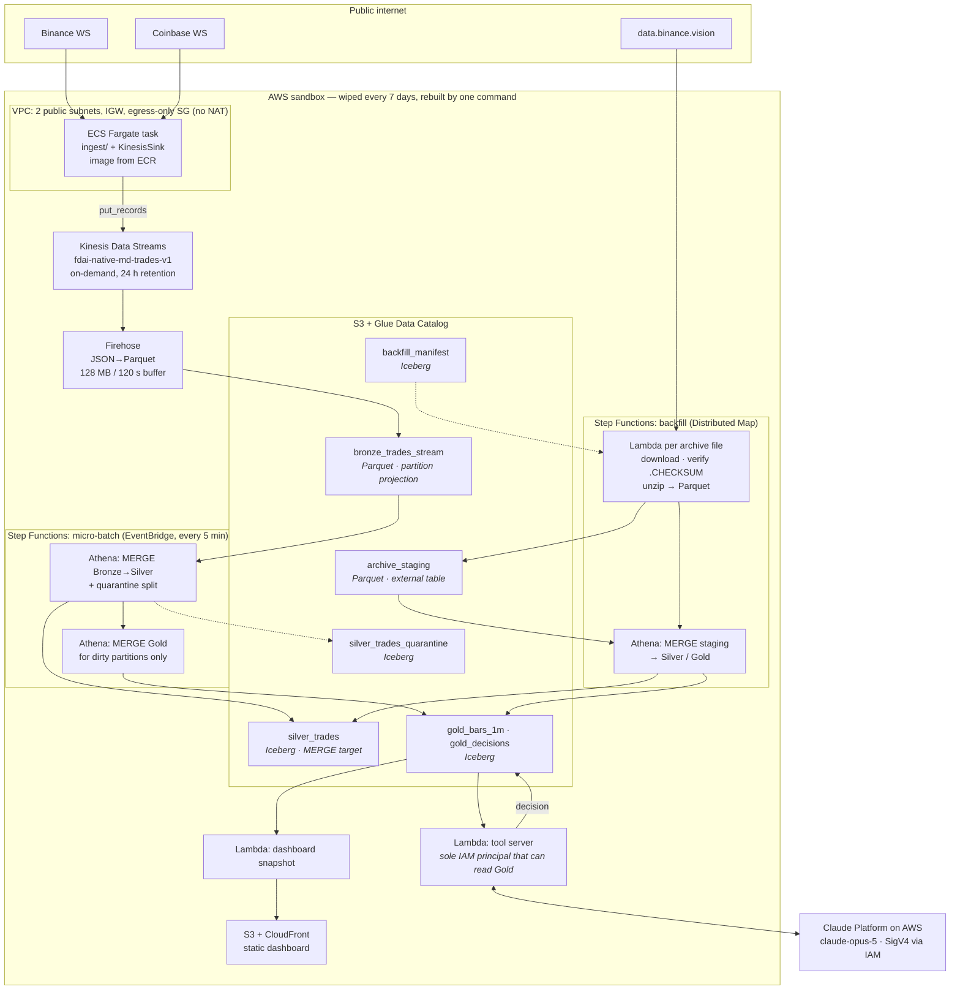

# AWS-Native Workstream — Design

**Date:** 2026-08-14
**Status:** Draft for review
**Parent specs:** [`2026-08-07-finance-data-ai-platform-design.md`](2026-08-07-finance-data-ai-platform-design.md) (business use case),
[`2026-08-08-data-layer-batch-history-and-serving-design.md`](2026-08-08-data-layer-batch-history-and-serving-design.md) (data-layer contracts)

A second implementation of the same business use case — live market data → medallion
lakehouse → point-in-time features → LLM trading-decision agent — built entirely on
AWS-managed services instead of Databricks. It exists to be a working, comparable
alternative on the same data contract, and to be *built by hand* as a way of learning the
platform.

The two workstreams share `ingest/`, `config/universe.yaml`, and
`ingest/schemas/trade.v1.avsc`. Everything below the stream is independent.

## 1. Purpose and constraints

### What is deliberately identical

The business use case, and the three correctness properties that are its actual substance:

1. **Gap detection and REST repair** — a WebSocket that silently misses 40 seconds of
   trades is the classic market-data failure, invisible unless explicitly detected.
2. **Convergent backfill dedupe on a natural key** — archive rows arrive days late by
   design and must collapse onto live rows without double-counting volume.
3. **Anti-lookahead enforced by the data layer, not the prompt** — a prompt is not an
   access boundary.

If this workstream reproduces those three properties on AWS primitives, it is a real
alternative. If it only moves bytes, it is a demo.

### Hard constraints

| Constraint | Consequence |
|---|---|
| Same AWS sandbox account, **wiped every 7 days** | Nothing durable lives anywhere; durability is re-derivation (§6) |
| **IAM role creation is available** (unlike the Databricks workstream) | The full managed-service palette is open: Lambda, Firehose, Glue, Step Functions, Fargate, Athena |
| Learning is a first-class goal | Prefer the service that teaches the concept over the one that hides it, where cost and correctness are equal |
| Portfolio-grade, not over-engineered | Every component must have exactly one job and a named reason to exist |
| Paper trading only | Risk engine still built as if real; execution simulated |

### The constraint that changed, and what it unlocks

The parent spec (§11) rejected **"Kinesis + Firehose → S3"** for three reasons:

1. Firehose delivery requires a service IAM role that cannot be created.
2. S3 in the sandbox account is wiped anyway.
3. It teaches less Kafka.

All three are now void. IAM roles are available. The wipe is the accepted durability model
(§6), not an objection. And *not being Kafka* is this workstream's entire point. **The
rejection is reversed deliberately and on the record**, so nobody reading both specs
concludes one of them is wrong.

### Non-goals

- Sub-second latency. Freshness target is a 5-minute micro-batch, same as the parent spec.
- Beating the Databricks workstream. They are alternatives on one contract, not competitors.
- Feature parity above the thin slice (§2). Named cuts stay named.

## 2. Scope — the thin end-to-end slice

One vertical slice where nothing is a stub, rather than one deep layer.

| Layer | In scope | Deliberately out |
|---|---|---|
| Ingest | Binance + Coinbase trades (reused connectors), Kinesis stream, Fargate task | news, order books, `md.bars`, Alpaca/equities |
| Bronze | `bronze_trades_stream` (Parquet on S3) | `ops_metrics_raw`, `news_raw` |
| Silver | `silver_trades` (Iceberg keyed upsert) + `silver_trades_quarantine` | cross-venue price sanity check (§5.4) |
| Gold | `gold_bars_1m`, `gold_decisions` | `gold_bars_1s`, `gold.features` as its own table, quant model |
| Backfill | deep tier (2 y of 1 m klines) + hot tier (aggTrades, small default window) | mid tier (1 s klines) |
| Serving | 3 typed tools, one agent decision, one static dashboard | vector index / RAG, NL-query surface, Batch backtest harness |

Two cuts need justifying rather than just listing:

**The mid tier (1 s klines) is cut** because it is a third archive parser serving a
granularity nothing in this slice consumes. It is additive later.

**Backfill cannot be cut.** With durability defined as re-derivation (§6), the backfill
loader *is* the durability mechanism. A slice without it is a slice that loses all history
every Sunday.

## 3. Architecture

### 3.1 Topology



### 3.2 Component inventory and ownership

| Component | Its one job | Terraform module | Survives the wipe? |
|---|---|---|---|
| ECR repository + Fargate service | run the producers | `native_producer` | no — rebuilt |
| Kinesis Data Streams | durable 24 h buffer | `native_stream` | no |
| Firehose delivery stream | land Bronze as Parquet | `native_stream` | no |
| S3 bucket + Glue database | hold every table | `native_lakehouse` | no — re-derived |
| Athena workgroup + prepared statements | run every transform and every read | `native_lakehouse` | no |
| Step Functions ×2 | micro-batch, backfill | `native_orchestration` | no |
| Lambda ×3 | archive I/O, tool server, snapshot | `native_serving` | no |
| CloudFront + S3 site | dashboard | `native_serving` | no |
| Anthropic workspace (Claude Platform on AWS) | the agent | not Terraform — Anthropic-side | **yes** |

Nothing is always-on except the single Fargate task. Every transform is pay-per-query.

### 3.3 Three structural decisions

**D1 — Bronze is plain Parquet, not Iceberg.** Bronze is append-only: no MERGE, no
time travel, no snapshot expiry. Iceberg buys nothing here and would add a Firehose
destination whose behaviour needs verifying, where Firehose's JSON→Parquet conversion with
time-based custom prefixes is long-established. Partition discovery uses **Athena partition
projection**, which removes the Glue crawler entirely — one fewer component, and no window
in which the catalog disagrees with S3.

**D2 — Silver and Gold are Iceberg on plain S3, not S3 Tables.** S3 Tables' headline
benefit is managed compaction and snapshot expiry. **The weekly wipe neutralises it** — no
table lives long enough to need compacting. The constraint that hurts everywhere else pays
for itself exactly once, here. (If durability ever moves to a permanent bucket, revisit
this: the argument evaporates with the wipe.)

**D3 — There is no Change Data Feed equivalent, and that is a simplification, not a gap.**
The Databricks design needed CDF because a DLT pipeline and a separate wheel wrote Silver
independently, so the Gold job had to *discover* what had changed. Here a single Step
Functions execution owns the Silver merge *and* the Gold rebuild as consecutive states, so
the dirty `(instrument_id, dt)` set is simply a return value passed between two steps. Both
writers — micro-batch and backfill — go through the same shared merge definition.

The honest trade-off: the Databricks design's argument for CDF was *"no writer has to
remember to mark anything."* Here a hypothetical fourth writer that bypassed the state
machine would be invisible. Mitigation is structural rather than procedural: the merge SQL
lives in one file used by both state machines, and adding a writer means adding a state.
Iceberg incremental reads (`start-snapshot-id`) remain the documented fallback if a writer
ever does need to live outside the orchestrator.

## 4. Ingestion

### 4.1 The sink seam already exists

`ingest/runner.py` already defines a `ProducerLike` protocol —
`produce(topic, trade)`, `poll(timeout)`, `flush(timeout)` — and `IngestRunner` depends on
that protocol, not on Kafka. **The seam this workstream needs is already there.** No
refactor of tested code is required; only a second implementation.

```text
ingest/core/sinks/base.py     Sink protocol (moved verbatim from runner.ProducerLike)
ingest/core/sinks/kafka.py    TradeProducer, moved from ingest/core/producer.py
awsnative/sink.py             KinesisSink — the only new implementation
```

`KinesisSink` lives under `awsnative/`, not `ingest/`, so that `ingest` never grows a boto3
dependency. Connectors keep knowing one venue's wire format; `core/` keeps knowing
resilience and nothing about transports.

`poll(0)` is not a no-op for Kinesis. `IngestRunner.drain` calls it after every `produce`
(`runner.py:84`), which makes it exactly the right hook to flush a batch when the buffer
reaches 500 records / 500 KB / 200 ms. The Kafka-shaped protocol turns out to fit.

`Trade.kafka_key()` (`{venue}|{venue_symbol}`) becomes the Kinesis **partition key**,
preserving per-instrument-per-venue ordering within a shard — the same property the Kafka
key bought.

### 4.2 The wire format changes from Avro to JSON, and why

Kinesis records have **no headers**. The Kafka path carries `schema_version`, `venue`,
`is_backfill`, and `source` as headers; three of those are already Avro fields, so only
`schema_version` genuinely needs a new home — inside the record body.

Given that the envelope has to change anyway, the record becomes **JSON with exactly the
fields of `trade.v1.avsc`, plus `schema_version`**. This buys the removal of a whole
component: Firehose converts JSON→Parquet natively against a Glue table schema, so no
transform Lambda sits in the hot path decoding Avro.

**The `.avsc` remains the single source of truth.** A contract test asserts that the JSON
encoder's output validates against `ingest/schemas/trade.v1.avsc` for generated `Trade`
values, so a field added on one side and not the other fails CI rather than a 3 a.m.
Firehose delivery. This is the same drift-is-impossible-by-construction property the Kafka
path gets from sharing the file — enforced by a test instead of by a shared decoder.

Cost of JSON: ~350 bytes/record versus ~150 for Avro, so Kinesis and Firehose per-GB
charges roughly double (§10). Parquet + Snappy at rest is unaffected.

### 4.3 Kinesis sizing

**On-demand mode**, not provisioned shards. Sizing is ~300 msg/s steady, but crypto trade
rates burst 5–10× during volatility, and a provisioned single shard caps at 1,000
records/s — a burst would throttle exactly when the data matters most. On-demand starts at
4 MB/s ÷ 4,000 records/s and scales itself.

Provisioned (2 shards) is roughly $3/mo cheaper (§10). It is the documented cost lever, not
the default: shard math is a thing to get wrong, and getting it wrong drops trades.

The sink must still handle `ProvisionedThroughputExceededException` with bounded
exponential backoff — on-demand doubles capacity within ~15 minutes of a sustained
increase, so an instantaneous spike above current capacity is throttled regardless of mode.
Records are never dropped: the sink blocks, which surfaces as queue backpressure, which the
`BoundedTopicQueue` BLOCK policy turns into a detectable, REST-repairable gap. **That chain
is why trades are never silently lost**, and it is inherited unchanged.

### 4.4 The producer host gets simpler

**ECS Fargate + ECR**, not EC2. With IAM available, the task pulls a signed image from ECR
and writes to Kinesis under a task role — no SSH, no keypair, no user-data `git clone`, no
credentials in user-data.

Dropping MSK removes, in one step: the three-phase ACL bootstrap, the `/32` SSH rule that
existed for one step of `make up`, the security-group client allowlist, the cross-account
NAT EIP dependency, the Databricks secret-scope publish, and the `make unlock` recovery
hatch. `make up-aws` should complete in minutes rather than 45–60.

The task runs in a **public subnet with `assign_public_ip`**, deliberately. It needs
outbound WSS to Binance and Coinbase; a NAT gateway would cost ~$32/mo — more than the rest
of the platform combined — to buy a private subnet this workload does not need.

## 5. Lakehouse

### 5.1 Bronze — `bronze_trades_stream`

Firehose writes Snappy Parquet under a custom prefix
`bronze_trades_stream/ingest_date=!{timestamp:yyyy-MM-dd}/`, giving Hive-style partitions
for free (time-based custom prefixes, *not* content-based dynamic partitioning, which is
billed per GB). Buffer 128 MB / 120 s: at a 5-minute merge cadence that puts end-to-end
producer→Silver lag at roughly p50 4 min, inside the parent spec's p50 < 6 min SLO.

Partitions are resolved by **Athena partition projection**
(`projection.enabled = true`, `projection.ingest_date.type = date`), so no crawler runs and
no partition is ever missing. Bronze is append-only and preserves the Kinesis metadata
Firehose provides (approximate arrival timestamp, sequence number) alongside the parsed
fields.

### 5.2 Silver — `silver_trades`, keyed upsert with no lateness cutoff

The Databricks design's load-bearing correction (§1.1 of the data-layer spec) is that
Silver must be a **keyed-upsert target, not a watermarked streaming dedupe** — a 10-minute
watermark would drop every next-day archive row and leave the reconciliation job
permanently red with no bug to find.

Iceberg `MERGE INTO` on `(venue, trade_id)` is the direct analogue of Databricks AUTO CDC,
and it has **no lateness cutoff at all**:

```sql
MERGE INTO silver_trades t
USING (SELECT ... FROM bronze_trades_stream WHERE ingest_date = ? AND <valid>) s
ON t.venue = s.venue AND t.trade_id = s.trade_id
WHEN NOT MATCHED THEN INSERT ...
```

`WHEN NOT MATCHED THEN INSERT` only — no update branch — because **a trade is an immutable
fact**. The stream copy and the archive copy of aggTrade `12345` carry the same exchange
`event_ts_us`, the same price, and the same size; which one lands first is immaterial.

This is stronger than SCD Type 1: SCD Type 1 *would* overwrite on a newer sequence, which
required the data-layer spec to argue at length (§4.2) that sequences tie and never
regress. Insert-if-absent needs no such argument. The immutability tripwire test carries
over regardless — if two rows ever share `(venue, trade_id)` with differing
`(event_ts_us, price, size)`, the assumption is broken and must be discovered by a test
rather than by a wrong backtest.

Silver is `PARTITIONED BY (instrument_id, day(event_ts))` — queries filter on both, and
`(instrument_id, dt)` is exactly the dirty-partition unit Gold rebuilds.

### 5.3 Gold — `gold_bars_1m`, additively decomposable

Gold stores numerators and denominators, never precomputed ratios, so a measure re-evaluated
at any grain stays correct. Storing a `vwap` column and averaging it is wrong at every grain
except the one it was computed at, and it fails *quietly*.

| Metric | Gold must store | Correct at any grain |
|---|---|---|
| VWAP | `notional`, `volume` | `SUM(notional)/SUM(volume)` |
| Realized vol | `sq_log_return` per bar | `SQRT(SUM(sq_log_return))` |
| Flow imbalance | `buy_vol`, `sell_vol`, `volume` | `(SUM(buy_vol)-SUM(sell_vol))/SUM(volume)` |

Plus `open/high/low/close`, `trade_count`, `venue_coverage`, and
`source_tier ∈ {DERIVED_FROM_TRADES, ARCHIVE_KLINE}`.

**One documented non-additive exception:** `open` and `close` are first/last by
`event_ts`, which cannot be re-derived additively when rolling 1 m bars up to 5 m. The read
paths therefore expose OHLC **only at 1 m grain**; any coarser rollup exposes VWAP, volume,
and imbalance measures but not OHLC. Stating this is the alternative to silently returning a
wrong `open`.

Gold is rebuilt by `MERGE INTO` keyed on `(instrument_id, window_end_ts)` — a single
Iceberg commit, idempotent, so re-running a failed step is safe. Only partitions in the
dirty set from the Silver step are touched: a backfill of one symbol-day rebuilds one
symbol-day.

### 5.4 Expectations and quarantine

Two `INSERT`s with complementary `WHERE` predicates: valid rows to `silver_trades`,
violations to `silver_trades_quarantine`. **Violations are never dropped** — silent discard
destroys the ability to explain a gap later.

| Check | In this slice |
|---|---|
| `price > 0`, `size > 0` | yes |
| `event_ts` within an epoch-sane range | yes |
| cross-venue price sanity vs the cross-venue median | **deferred** — needs a window over other venues; additive later |

**A correction carried into this design.** The parent spec's recency bound is
`event_ts ∈ [now - 1d, now + 1m]`. Applied uniformly that quarantines every archive
backfill row, since archives are published next-day — the same class of contradiction the
data-layer spec caught in the watermark. The bound is therefore **source-dependent**:
`STREAM` rows get `[now - 1d, now + 1m]`; `ARCHIVE` and `REST_REPAIR` rows get
`[now - 2y, now + 1m]`.

## 6. Durability by re-derivation

The sandbox is wiped every 7 days and there is no permanent account. **Re-derivation is
the durability model**, which makes the backfill loader load-bearing infrastructure rather
than a history nicety.

### 6.1 Tiers, and the cost dial

| Tier | Archive path (`.../data/spot/daily/`) | Default window | Natural key | Rebuild cost |
|---|---|---|---|---|
| deep | `klines/{SYM}/1m/...zip` | 2 years | `(sym, open_time)` | ~5,840 files, ~$1 |
| hot | `aggTrades/{SYM}/...zip` | **3 days** (parameter) | `aggTradeId` | ~24 files, minutes |
| mid | `klines/{SYM}/1s/...zip` | — | — | cut (§2) |

The hot-tier window is the single most important cost parameter in this design and is
therefore explicit, not implicit. The data-layer spec's 30-day hot tier is right when
storage is permanent; here it would be re-downloaded and re-merged *every week*. Default 3
days — enough to prove convergence and give the reconciliation check a non-empty overlap —
widened by a variable when a specific backtest needs it.

Deep-tier klines feed **`gold_bars_1m` directly** with `source_tier = ARCHIVE_KLINE`; they
are bars, not trades, and must not be merged into `silver_trades`. Only hot-tier aggTrades
merge into Silver. Conflating the two would put bar rows in a trade table.

### 6.2 Loader contract

Idempotent and resumable via `backfill_manifest`:

```text
(venue, instrument_id, tier, dt, url,
 sha256_expected, sha256_actual, row_count,
 status ∈ PENDING|RUNNING|DONE|FAILED|SKIPPED_NO_DATA,
 attempt, started_ts, completed_ts, error)
```

A run skips `DONE` partitions. Every archive file has a sibling `.CHECKSUM`; **verifying it
is what makes `DONE` trustworthy enough to skip** — an unverified skip is an assumption with
a timestamp.

Implementation: **Step Functions Distributed Map** over the manifest, one Lambda per file.
Lambda does I/O only — download, verify checksum, unzip, parse, write Parquet to
`archive_staging`. All merging is Athena SQL against a staging external table. That keeps
exactly one transform engine and makes the parsers unit-testable offline against golden
fixtures.

### 6.3 The two parsing traps, carried over

**`isBuyerMaker` inverts.** `isBuyerMaker = true` means the *buyer* was the maker, so the
aggressor is the **seller** → `side = SELL`. Getting this backwards flips every
flow-imbalance feature and no downstream check would catch it — the data stays well-formed,
merely wrong.

**Timestamp units are not constant across the range.** Binance changed archive timestamps
from milliseconds to microseconds partway through the 2-year window. The loader must
**detect** the unit per file by magnitude against a sane epoch bound and normalise to
microseconds. Assuming either unit puts part of the history off by 1000×.

Both get golden-file unit tests, matching the connector testing culture already in the repo.

### 6.4 Fidelity and reconciliation, scoped honestly

Outside the hot window there are no trades, only bars: flow imbalance stays computable from
klines' `takerBuyBaseVolume`, but at bar granularity rather than trade granularity. Without
a marker, a two-year backtest silently mixes high-fidelity recent inputs with lower-fidelity
older ones, and the model appears to improve over time when all that improved is the input
data.

In this slice the marker is **`source_tier` on `gold_bars_1m`** (§5.3), which carries exactly
that distinction. The data-layer spec's `fidelity ∈ {EXACT, DERIVED}` column belongs to
`gold.features`, which is out of scope (§2); when that table arrives, `fidelity` is derived
from the `source_tier` of the bars each feature row was computed from. Until then,
`source_tier` is the single fidelity signal and the eval harness asserts homogeneity over it
across a backtest window — a mixed window is a **finding to report**, not a warning to
suppress.

Within the hot window both `DERIVED_FROM_TRADES` and `ARCHIVE_KLINE` bars exist for the
same minutes, and **that overlap is the reconciliation** — stream-derived OHLCV against
Binance's published klines, against the parent spec's < 0.01 % SLO. Outside it, the bars
*are* the klines, so comparing them would be self-comparison dressed as a proof.

The nightly job reports **discrepancy and coverage together**. A pass over zero comparable
bars must read as *"no evidence"*, never as *"correct"*. A green check that cannot fail is
worse than no check, because it is trusted.

## 7. Serving and the point-in-time boundary

### 7.1 What AWS does not have, stated plainly

The Databricks design enforced anti-lookahead in the **semantic layer**: a `*_pit` Metric
View declaring an `as_of` parameter and a `filter: window_end_ts <= as_of`, so the view
*physically cannot* return the future no matter who queries it. **AWS has no equivalent
primitive.** Pretending otherwise would be the most dangerous thing this document could do.

What AWS does have is two weaker mechanisms that, composed, are stronger than a prompt and
weaker than a metric view:

**Athena prepared statements** are the closest analogue. A named, workgroup-scoped statement
whose `WHERE` clause carries a bound parameter:

```sql
PREPARE bars_1m_pit FROM
SELECT instrument_id,
       SUM(notional)/SUM(volume)      AS vwap,
       SQRT(SUM(sq_log_return))       AS realized_vol,
       SUM(volume)                    AS volume
FROM gold_bars_1m
WHERE instrument_id = ? AND window_end_ts <= ?
GROUP BY instrument_id
```

The filter lives in the catalog, not in application code, and is versioned in Terraform. But
unlike a metric view, nothing stops a principal from issuing a raw query instead.

**So the real boundary is IAM.** The tool-server Lambda role is the **only** principal
granted `glue:GetTable` / `s3:GetObject` on the Gold prefix plus
`athena:StartQueryExecution` in that workgroup. The agent has no database credentials at
all; it can only call tools. That is a genuine access boundary — enforced by the platform,
not by instruction — and it is what makes the guarantee real.

**Two families of prepared statement**, mirroring the Databricks design's `*_pit` /
`*_current` split, because each family is honest about time in a different way:

| Family | `as_of` parameter | Consumer | Why the split |
|---|---|---|---|
| `*_pit` | **required** | tool server → agent, backtests | Anti-lookahead; every read is as-of a stated instant |
| `*_current` | none | dashboard snapshot Lambda | "Current state" is the one context where `as_of = now` is correct |

The dashboard reads `*_current` only, enforced by IAM rather than convention: the snapshot
Lambda's role cannot execute the `*_pit` statements, and the tool-server role cannot execute
the `*_current` ones. Without that separation a dashboard query could silently pick up a
default `as_of` — a lookahead leak that raises no error.

Defence in depth, three layers, each independently testable: IAM scope, the prepared
statement's parameterised filter, and a lookahead-injection test that **must fail if the
filter is removed**.

The residual gap versus the Databricks design is honest and worth recording: there, a
*newly written* tool that forgot to filter still could not leak the future. Here it could,
if it queried raw Gold from inside the tool-server role. The CI contract test — every
`*_pit` `.sql` file declares an `as_of` parameter, asserted by parsing the files, not by
review — is what closes that specific hole.

### 7.2 Tool surface

The parent spec's narrow typed tools are kept as the agent's interface; narrow tools are
easier for a model to use correctly and easier to evaluate than one generic query tool.
Three in this slice:

| Tool | Returns | Backed by |
|---|---|---|
| `get_price_context(instrument_id, as_of, lookback)` | OHLCV, VWAP, realized vol, flow imbalance | `bars_1m_pit` prepared statement |
| `get_portfolio_state(as_of)` | positions, cash, exposure | `gold_decisions` replayed to `as_of` |
| `get_risk_limits()` | caps and halts | `config/risk_limits.yaml` |

Deferred with reasons: `get_features` and `get_quant_signal` (need `gold.features` and a
registered model), `get_news` and `search_history` (need a news producer and a vector index —
and note `news.articles.v1` has never had a producer in *either* workstream).

The tool server holds **no aggregation logic**. It marshals parameters and injects `as_of`.

### 7.3 The AI layer — Claude Platform on AWS, not Bedrock

Three ways to reach Claude from AWS. The choice matters more than it looks.

| | Claude Platform on AWS | Amazon Bedrock | Anthropic API direct |
|---|---|---|---|
| Operated by | Anthropic, via AWS | AWS | Anthropic |
| Auth | **SigV4 / IAM role** | SigV4 / IAM role | API key in Secrets Manager |
| Model ID | `claude-opus-5` | `anthropic.claude-opus-5` | `claude-opus-5` |
| Feature parity | **same-day** | subset | reference |
| **Message Batches** | **yes** | **no** | yes |
| Automatic prompt caching | yes | no (manual `cache_control` only) | yes |
| Billing | AWS Marketplace | AWS | Anthropic |

**Bedrock is disqualified by the missing Batches API.** The parent spec's backtest is
~5,000 decisions over two years and its economics assume the Batch API's 50 % discount.
Losing Batches does not degrade the backtest, it changes its cost by 2×. Bedrock also drops
automatic prompt caching, and the parent spec's cache strategy is a stated SLI
(`cache_read_input_tokens > 0`).

**Claude Platform on AWS is chosen** because it is Anthropic-operated with same-day parity
*and* AWS-native where it counts: the Lambda authenticates with its execution role via
SigV4, so there is **no API key anywhere** — nothing in Secrets Manager, nothing to rotate,
nothing to leak. That is a real security improvement over the direct API, and it is exactly
the AWS-native property this workstream is meant to demonstrate.

Client, in the tool-server Lambda (`pip install "anthropic[aws]"`):

```python
from anthropic import AnthropicAWS
client = AnthropicAWS()   # AWS_REGION + ANTHROPIC_AWS_WORKSPACE_ID from env
```

Region and `workspace_id` are both **required** — there is no default fallback, and a
missing value throws at client construction before any request is sent. A 403 means the
request reached the server: wrong `workspace_id`, or a missing IAM action on the role.

It also interacts well with the weekly wipe: the Anthropic workspace is **Anthropic-side and
permanent**. Only the IAM role is recreated. Bedrock's per-account/per-region model access
is account state and may well be wiped — one more thing `make up-aws` would have to
re-establish.

### 7.4 Model configuration

- **`claude-opus-5`.** Adaptive thinking is **on by default** on this model — omitting the
  `thinking` parameter runs it. `max_tokens` caps thinking *plus* response text together, so
  it is sized generously (16,000) rather than tightly around the expected JSON.
- **`output_config.effort`** starts at `high`, then swept. `low` and `medium` are unusually
  strong on this model and are the primary cost lever. Do not try to shorten output by
  lowering effort — that is not what it controls.
- **Structured output via `output_config.format`** with a JSON schema, not parsed out of
  prose. Fields per the parent spec: `action`, `conviction`, `horizon`, `size_pct`,
  `rationale`, `key_risks[]`, `evidence[]` (each `{source, ref, timestamp}`),
  `invalidation_condition`.
- **Prompt caching.** Stable prefix first — strategy doctrine, risk policy, output contract,
  tool definitions — volatile market snapshot last. Opus 5's minimum cacheable prefix is
  **512 tokens**, so even a modest doctrine block caches. Verified by asserting
  `cache_read_input_tokens > 0`; a silent cache miss is otherwise invisible.
- **Refusals.** Check `stop_reason == "refusal"` **before** reading `content` — a refusal is
  an HTTP 200 with empty or partial content, so indexing `content[0]` unconditionally
  breaks. The server-side `fallbacks` parameter is first-party-only and its Claude Platform
  on AWS support is still being validated, so the fallback here is the client-side
  `BetaRefusalFallbackMiddleware` registered on the client.
- **Tool loop** via the SDK tool runner (`client.beta.messages.tool_runner` with
  `@beta_tool`-decorated functions) rather than a hand-written loop — the runner's per-turn
  hooks already cover approval gating and result inspection.

### 7.5 Guardrails

Unchanged in substance from the parent spec, because they are the point:

- Paper trading only. There is no `LIVE_TRADING_ENABLED` flag to accidentally flip.
- A deterministic risk engine can veto the model: position caps, max-drawdown halt,
  per-asset exposure. **The LLM proposes; code disposes.**
- Every decision persisted to `gold_decisions` with prompt hash, model id, effort, tool
  calls, and realised outcome — auditable after the fact.

### 7.6 Dashboard

A Lambda runs the `*_current` queries on a schedule, writes one JSON snapshot to S3, and a
static page on CloudFront renders it. Panels: decision log with rationale and outcome,
bars/VWAP, quarantine rate, backfill coverage, reconciliation discrepancy **with coverage**,
and fidelity mix.

QuickSight is the nominally AWS-native BI answer and is rejected for this account:
per-user subscriptions are account-level state, awkward to define in Terraform, and
annoying to recreate weekly. A static snapshot has zero always-on cost and rebuilds in
seconds.

## 8. Reproducibility contract

Same contract as the Databricks workstream, with a different blast radius.

- `make up-aws` — empty account to streaming data plus re-derived history. Target: minutes
  for infrastructure, plus the backfill window's own runtime.
- `make down-aws` — destroys the AWS-native stack. Leaves the Kafka/Databricks stack alone.
- **Any manual console step is a bug** *once a stage is complete*. During the learning build
  (§12) console exploration is the point; by the end of each stage, `terraform apply` must
  produce the whole stage from empty.
- Terraform state lives in the **existing** `fdai-tfstate-<account-id>` bucket under a
  distinct key, with its own DynamoDB lock item. The two workstreams share the state backend
  and nothing else, so either can be destroyed without touching the other.
- Its loss remains atomic with the resources it describes, so state and reality stay
  consistent (both empty).
- No secrets in git, and — because of §7.3 — no LLM API key anywhere at all.

## 9. Testing

| Layer | What | Runs offline? |
|---|---|---|
| Unit | JSON encoder validates against `trade.v1.avsc` (drift tripwire) | yes |
| Unit | Archive parsers vs golden fixtures: `isBuyerMaker` → side, timestamp-unit detection | yes |
| Unit | Additive measure math (VWAP/vol/imbalance at two grains agree) | yes |
| Unit | `KinesisSink` batching, partition keying, throttle backoff against a fake client | yes |
| Contract | Every `*_pit` `.sql` declares an `as_of` parameter — asserted by parsing files in CI | yes |
| Contract | Immutability tripwire: no two rows share `(venue, trade_id)` with differing `(event_ts_us, price, size)` | yes |
| Integration | archive → staging → Silver → Gold; assert stream/archive overlap converges to one row per trade | no — dev Athena |
| Lookahead | Insert a future bar; assert the prepared statement at an earlier `as_of` excludes it. **Must fail if the filter is removed.** | no — dev Athena |
| Data quality | Quarantine rate; nightly reconciliation with coverage | no |
| Infra | `terraform validate`, `tflint`, `checkov` | yes |

### 9.1 The honest weakness

SQL transforms do not unit-test offline the way `lakehouse/trades/transforms.py` does today.
`make lakehouse-test` runs real PySpark against real Iceberg on a laptop; there is no
equivalent for Athena.

Mitigation, and its limits: transforms live as parameterised `.sql` files rendered by a small
Python module, so **parameter binding and query shape** are unit-tested offline, and the
`*_pit` contract test is a genuine offline check of the security-relevant property. But
**semantic** correctness of the merge and the aggregation is proven only by the integration
test against a real dev Athena workgroup. That is weaker, it is a real cost of the
Athena-first choice, and it is the strongest argument for the Glue Spark alternative (§11).

## 10. Cost

At the existing ~30 h/week operating discipline (~130 h/month):

| Item | Estimate |
|---|---|
| Kinesis Data Streams, on-demand | ~$9 |
| Firehose (delivery + Parquet conversion) | ~$2 |
| Fargate task (0.5 vCPU / 1 GB) + ECR | ~$3 |
| Athena (micro-batch merges + Gold rebuilds + reads) | ~$4 |
| Backfill (Lambda + Athena + S3 requests), weekly rebuild | ~$4 |
| S3 storage, Step Functions, Lambda, CloudFront | ~$1 |
| **AWS subtotal** | **~$23** |
| Claude Platform on AWS | variable; a few $/mo at demo volume |
| **Total, with discipline** | **~$25–35/mo** |

Comparable to or below the Databricks path's stated $40–80/mo, with a different shape: no
DBUs, but per-GB streaming charges that JSON-on-the-wire roughly doubles (§4.2).

Levers, in order of effect: shrink the **hot-tier backfill window** (§6.1); switch Kinesis
to **2 provisioned shards** (~$3/mo saving, adds throttle risk); lengthen the **micro-batch
cadence** from 5 to 15 minutes (~⅔ off Athena, costs freshness); run fewer hours.

Guards: TTL tags on every resource; `make down-aws` as routine; no always-on compute except
the one Fargate task; a budget alarm at a hard threshold.

## 11. Assumptions to verify

Following the parent spec's pattern: each assumption has a named fallback, so discovering
one is false is a course correction rather than a redesign.

| # | Assumption | Fallback if false |
|---|---|---|
| A1 | Firehose JSON→Parquet with a time-based custom prefix yields partitions Athena reads via projection | Land raw JSON; add an Athena CTAS compaction step to build Bronze |
| A2 | Athena engine v3 `MERGE INTO` on Iceberg is available in the account's region | `DELETE` + `INSERT` per dirty partition (two commits), or Glue Spark for Silver only |
| A3 | Athena prepared statements accept a parameter in the `window_end_ts <= ?` position | Tool server injects a literal; enforcement drops to one chokepoint + the lookahead test |
| A4 | Claude Platform on AWS is available in-region and its Marketplace subscription is SCP-permitted | Bedrock `anthropic.claude-opus-5` (loses Batches, §7.3), or direct Anthropic API with a key in Secrets Manager |
| A5 | SCP permits Kinesis, Firehose, Athena, Glue, Step Functions, ECS/Fargate, ECR, CloudFront | Verify per service in stage N0 before building on it; MSK was permitted, so the account is not heavily locked down |
| A6 | The Anthropic workspace survives the weekly wipe (it is Anthropic-side) | Add a re-subscribe/verify step to `make up-aws` |
| A7 | Fargate in a public subnet with `assign_public_ip` reaches Binance/Coinbase WSS | NAT gateway (+~$32/mo), or move the producer back to EC2 |
| A8 | `client.beta.messages.tool_runner` works on the `AnthropicAWS` client | Hand-written tool loop (the parent spec's original shape) |
| A9 | Lambda's 15 min / 10 GB is enough for the largest hot-tier aggTrades zip | Glue Python Shell job for the hot tier only; deep tier stays on Lambda |

A1 and A2 are the only two that would reshape the design. The rest degrade locally.

## 12. Decomposition into build stages

Each stage is independently verifiable and independently demoable, and each ends with
`terraform apply` reproducing it from empty.

| # | Stage | Ships | Depends on |
|---|---|---|---|
| N0 | Account prep, Terraform root, service permission checks | An empty, verified foundation; every A5 answer known | — |
| N1 | Producer → Kinesis → Firehose → Bronze | Live trades queryable in Athena | N0 |
| N2 | Silver merge + expectations + quarantine | Convergent keyed dedupe, nothing silently dropped | N1 |
| N3 | Gold `bars_1m` + dirty-partition rebuild | Queryable 1 m bars with additive components | N2 |
| N4 | Backfill deep + hot tier, manifest, reconciliation | History re-derived; the weekly rebuild proven end to end | N3 |
| N5 | Prepared statements + tool server + IAM boundary | Anti-lookahead enforced and tested | N3 |
| N6 | Agent + decision persistence + dashboard | One honest end-to-end decision, auditable | N4, N5 |

Reconciliation belongs to **N4**, not N3 — it is meaningless until archive klines exist to
compare against, and attempting it in N3 produces exactly the vacuous green check §6.4
warns about.

## 13. Rejected alternatives

- **Keep MSK, swap only the lakehouse.** Least new ingest code, but retains the three-phase
  ACL bootstrap, the ~50-minute `make up`, and MSK's hourly cost — and is the least
  AWS-native option available. It mostly re-runs workstream 1 with a different sink.
- **Glue 5.0 Spark for the medallion.** Genuinely attractive: it reuses
  `lakehouse/trades/transforms.py` almost verbatim, so both workstreams provably run the
  same logic, and `make lakehouse-test` keeps working offline. Rejected on cost — 2 DPU ×
  ~2 min × 288 runs/day is ≈ $250/mo at a 5-minute cadence, and staying near budget means
  dropping to a 30-minute cadence, which degrades the freshness SLO. Glue is the right
  engine for large occasional jobs, not small frequent ones; it stays the named fallback for
  A2 and A9.
- **S3 Tables for managed Iceberg.** Its compaction and snapshot-expiry benefits are
  neutralised by the weekly wipe (D2). Revisit if storage ever becomes permanent.
- **Amazon Bedrock for the agent.** No Message Batches API, no automatic prompt caching
  (§7.3). Retained as the A4 fallback.
- **MWAA (managed Airflow) for orchestration.** ~$0.49/h minimum — more than the entire rest
  of the platform — for DAGs that Step Functions expresses natively.
- **QuickSight for BI.** Per-user subscriptions are account-level state that is awkward in
  Terraform and must be recreated weekly (§7.6).
- **Iceberg for Bronze.** Append-only data needs no MERGE, no time travel, and no snapshot
  expiry (D1).
- **A CDF equivalent via Iceberg incremental reads.** Unnecessary while one state machine
  owns both the Silver merge and the Gold rebuild (D3). Retained as the documented fallback
  for a future out-of-band writer.
- **A permanent cross-account bucket as the system of record.** Would remove the weekly
  re-backfill entirely and mirror the Databricks two-account shape — but requires a durable
  bucket in an account the user controls at the AWS level, which is not available. Rejected
  on availability, not on merit; it is the first thing to revisit if a permanent account
  appears.
